# LLM RL Papers

1. Monitoring recent cross-research on LLM &amp; RL;
2. Focusing on combining their capabilities for **control** (such as game characters, robotics);
3. Feel free to open PRs if you want to share the good papers you’ve read.

***

* <a href="#research-review" style="color: black; text-decoration: none; font-size: 20px; bold: true; font-weight: 700"> Research Review</a>

   + [LLM-based Multi-Agent Reinforcement Learning: Current and Future Directions](#llm-based-multi-agent-reinforcement-learning-current-and-future-directions)
   + [A Survey on Large Language Model-Based Game Agents](#a-survey-on-large-language-model-based-game-agents)
   + [Survey on Large Language Model-Enhanced Reinforcement Learning: Concept, Taxonomy, and Methods ](#survey-on-large-language-model-enhanced-reinforcement-learning-concept-taxonomy-and-methods)
   + [The RL and LLM Taxonomy Tree Reviewing Synergies Between Reinforcement Learning and Large Language Models](#the-rl-and-llm-taxonomy-tree-reviewing-synergies-between-reinforcement-learning-and-large-language-models)

* <a href="#llm-rl-papers" style="color: black; text-decoration: none; font-size: 20px; bold: true; font-weight: 700">LLM RL Papers [sort by method]</a>

   - **Action**

     - Directly

       →[iLLM-TSC: Integration reinforcement learning and large language model for traffic signal control policy improvement](#iLLM-TSC-Integration-reinforcement-learning-and-large-language-model-for-traffic-signal-control-policy-improvement)

       →[SRLM: Human-in-Loop Interactive Social Robot Navigation with Large Language Model and Deep Reinforcement Learning ](#srlm-human-in-loop-interactive-social-robot-navigation-with-large-language-model-and-deep-reinforcement-learning)

       →[Knowledgeable Agents by Offline Reinforcement Learning from Large Language Model Rollouts](#knowledgeable-agents-by-offline-reinforcement-learning-from-large-language-model-rollouts)

       →[Policy Improvement using Language Feedback Models](#policy-improvement-using-language-feedback-models)

       →[True Knowledge Comes from Practice: Aligning LLMs with Embodied Environments via Reinforcement Learning](#true-knowledge-comes-from-practice-aligning-llms-with-embodied-environments-via-reinforcement-learning)

       →[Large Language Model as a Policy Teacher for Training Reinforcement Learning Agents](#large-language-model-as-a-policy-teacher-for-training-reinforcement-learning-agents)

       →[LLM Augmented Hierarchical Agents](#llm-augmented-hierarchical-agents)

       →[Large Language Models as Generalizable Policies for Embodied Tasks](#large-language-models-as-generalizable-policies-for-embodied-tasks)

       →[Octopus: Embodied Vision-Language Programmer from Environmental Feedback](#octopus-embodied-vision-language-programmer-from-environmental-feedback)

       →[RE-MOVE: An Adaptive Policy Design for Robotic Navigation Tasks in Dynamic Environments via Language-Based Feedback](#re-move-an-adaptive-policy-design-for-robotic-navigation-tasks-in-dynamic-environments-via-language-based-feedback)

       →[Grounding Large Language Models in Interactive Environments with Online Reinforcement Learning](#grounding-large-language-models-in-interactive-environments-with-online-reinforcement-learning)

       →[Collaborating with language models for embodied reasoning](#collaborating-with-language-models-for-embodied-reasoning)

       →[Inner Monologue: Embodied Reasoning through Planning with Language Models](#inner-monologue-embodied-reasoning-through-planning-with-language-models)

       →[Do As I Can, Not As I Say: Grounding Language in Robotic Affordances](#do-as-i-can-not-as-i-say-grounding-language-in-robotic-affordances)

       →[Keep CALM and Explore: Language Models for Action Generation in Text-based Games](#keep-calm-and-explore-language-models-for-action-generation-in-text-based-games)

     - Indirectly
       
       →[Large Language Model Guided Reinforcement Learning Based Six-Degree-of-Freedom Flight Control](#Large-Language-Model-Guided-Reinforcement-Learning-Based-Six-Degree-of-Freedom-Flight-Control)
       
       →[Enabling Intelligent Interactions between an Agent and an LLM: A Reinforcement Learning Approach](#enabling-intelligent-interactions-between-an-agent-and-an-llm-a-reinforcement-learning-approach)
       
       →[RL-GPT: Integrating Reinforcement Learning and Code-as-policy](#rl-gpt-integrating-reinforcement-learning-and-code-as-policy)

   - **Data Preference**

     →[Reinforcement Learning from LLM Feedback to Counteract Goal Misgeneralization](#reinforcement-learning-from-llm-feedback-to-counteract-goal-misgeneralization)

   - **Data generation**

     →[RLingua: Improving Reinforcement Learning Sample Efficiency in Robotic Manipulations With Large Language Models](#rlingua-improving-reinforcement-learning-sample-efficiency-in-robotic-manipulations-with-large-language-models)

   - **Environment Configuration**

     →[Enhancing Autonomous Vehicle Training with Language Model Integration and Critical Scenario Generation](#enhancing-autonomous-vehicle-training-with-language-model-integration-and-critical-scenario-generation)

     →[EnvGen: Generating and Adapting Environments via LLMs for Training Embodied Agents](#envgen-generating-and-adapting-environments-via-llms-for-training-embodied-agents)

   - **Path Point**

     →[HighwayLLM: Decision-Making and Navigation in Highway Driving with RL-Informed Language Model](#HighwayLLM-Decision-Making-and-Navigation-in-Highway-Driving-with-RL-Informed-Language-Model)

   - **Prediction**

     →[Learning to Model the World with Language](#learning-to-model-the-world-with-language)

   - **Reward Function**

     →[Agentic Skill Discovery](#agentic-skill-discovery)

     →[LEAGUE++: EMPOWERING CONTINUAL ROBOT LEARNING THROUGH GUIDED SKILL ACQUISITION WITH LARGE LANGUAGE MODELS](#league-empowering-continual-robot-learning-through-guided-skill-acquisition-with-large-language-models)

     →[PREDILECT: Preferences Delineated with Zero-Shot Language-based Reasoning in Reinforcement Learning](#predilect-preferences-delineated-with-zero-shot-language-based-reasoning-in-reinforcement-learning)

     →[Auto MC-Reward: Automated Dense Reward Design with Large Language Models for Minecraft](#auto-mc-reward-automated-dense-reward-design-with-large-language-models-for-minecraft)

     →[Accelerating Reinforcement Learning of Robotic Manipulations via Feedback from Large Language Models](#accelerating-reinforcement-learning-of-robotic-manipulations-via-feedback-from-large-language-models)

     →[Eureka: Human-Level Reward Design via Coding Large Language Models](#eureka-human-level-reward-design-via-coding-large-language-models)

     →[Motif: Intrinsic Motivation from Artificial Intelligence Feedback](#motif-intrinsic-motivation-from-artificial-intelligence-feedback)

     →[Text2Reward: Automated Dense Reward Function Generation for Reinforcement Learning](#text2reward-automated-dense-reward-function-generation-for-reinforcement-learning)

     →[Self-Refined Large Language Model as Automated Reward Function Designer for Deep Reinforcement Learning in Robotics](#self-refined-large-language-model-as-automated-reward-function-designer-for-deep-reinforcement-learning-in-robotics)

     →[Language to Rewards for Robotic Skill Synthesis](#language-to-rewards-for-robotic-skill-synthesis)

     →[Reward Design with Language Models](#reward-design-with-language-models)

     →[Read and Reap the Rewards: Learning to Play Atari with the Help of Instruction Manuals](#read-and-reap-the-rewards-learning-to-play-atari-with-the-help-of-instruction-manuals)

   - **Skills Planning**

     →[Skill Reinforcement Learning and Planning for Open-World Long-Horizon Tasks](#skill-reinforcement-learning-and-planning-for-open-world-long-horizon-tasks)

     →[Long-horizon Locomotion and Manipulation on a Quadrupedal Robot with Large Language Model](#long-horizon-locomotion-and-manipulation-on-a-quadrupedal-robot-with-large-language-model)

   - **State Representation**

     →[LLM-Empowered State Representation for Reinforcement Learning](#LLM-Empowered-State-Representation-for-Reinforcement-Learning)

     →[Natural Language Reinforcement Learning](#natural-language-reinforcement-learning)

     →[State2Explanation: Concept-Based Explanations to Benefit Agent Learning and User Understanding](#state2explanation-concept-based-explanations-to-benefit-agent-learning-and-user-understanding)

   - **Task Suggestion**

     →[Hierarchical Continual Reinforcement Learning via Large Language Model](#hierarchical-continual-reinforcement-learning-via-large-language-model)

     →[AutoRT: Embodied Foundation Models for Large Scale Orchestration of Robotic Agents](#autort-embodied-foundation-models-for-large-scale-orchestration-of-robotic-agents)

     →[Language and Sketching: An LLM-driven Interactive Multimodal Multitask Robot Navigation Framework](#language-and-sketching-an-llm-driven-interactive-multimodal-multitask-robot-navigation-framework)

     →[LgTS: Dynamic Task Sampling using LLM-generated sub-goals for Reinforcement Learning Agents](#lgts-dynamic-task-sampling-using-llm-generated-sub-goals-for-reinforcement-learning-agents)

     →[RLAdapter: Bridging Large Language Models to Reinforcement Learning in Open Worlds](#rladapter-bridging-large-language-models-to-reinforcement-learning-in-open-worlds)

     →[ExpeL: LLM Agents Are Experiential Learners](#expel-llm-agents-are-experiential-learners)

     →[Guiding Pretraining in Reinforcement Learning with Large Language Models](#guiding-pretraining-in-reinforcement-learning-with-large-language-models)

   - **Transformers Framework**

     →[Unleashing the Power of Pre-trained Language Models for Offline Reinforcement Learning](#unleashing-the-power-of-pre-trained-language-models-for-offline-reinforcement-learning)

     →[AMAGO: Scalable In-Context Reinforcement Learning for Adaptive Agents](#amago-scalable-in-context-reinforcement-learning-for-adaptive-agents)

     →[Transformers are Sample-Efficient World Models](#transformers-are-sample-efficient-world-models)

* <a href="#foundational-approaches-in-reinforcement-learning" style="color: black; text-decoration: none; font-size: 20px; bold: true; font-weight: 700"> Foundational Approaches in Reinforcement Learning</a>

	→[Using Natural Language for Reward Shaping in Reinforcement Learning](#using-natural-language-for-reward-shaping-in-reinforcement-learning)

	→[DQN-TAMER: Human-in-the-Loop Reinforcement Learning with Intractable Feedback](#dqn-tamer-human-in-the-loop-reinforcement-learning-with-intractable-feedback)

	→[Overcoming Exploration in Reinforcement Learning with Demonstrations](#overcoming-exploration-in-reinforcement-learning-with-demonstrations)

	→[Automatic Goal Generation for Reinforcement Learning Agents](#automatic-goal-generation-for-reinforcement-learning-agents)

* <a href="#open-source-rl-environment" style="color: black; text-decoration: none; font-size: 20px; bold: true; font-weight: 700">Open source RL environment </a>

***

## Research Review

##### LLM-based Multi-Agent Reinforcement Learning: Current and Future Directions

- Paper Link: [arXiv 2405.11106](https://arxiv.org/abs/2405.11106)
- Overview: 

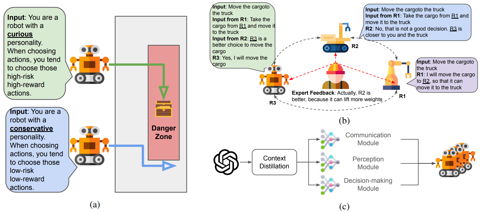

Potential research directions for language-conditioned Multi-Agent Reinforcement Learning (MARL). 
(a) Personalityenabled cooperation, where different robots have different personalities defined by the commands. 
(b) Language-enabled humanon-the-loop frameworks, where humans supervise robots and provide feedback. 
(c) Traditional co-design of MARL and LLM, where knowledge about different aspects of LLM is distilled into smaller models that can be executed on board.

***

##### A Survey on Large Language Model-Based Game Agents

- Paper Link: [arXiv 2404.02039](https://arxiv.org/abs/2404.02039), [Homepage](https://github.com/git-disl/awesome-LLM-game-agent-papers)
- Overview:

The conceptual architecture of LLMGAs. At each game step, the **perception** module perceives the multimodal information from the game environment, including textual, images, symbolic states, and so on. The agent retrieves essential memories from the **memory** module and take them along with perceived information as input for **thinking** (reasoning, planning, and reflection), enabling itself to formulate strategies and make informed decisions. The **role-playing** module affects the decision-making process to ensure that the agent’s behavior aligns with its designated character. Then the **action** module translates generated action descriptions into executable and admissible actions for altering game states at the next game step. Finally, the **learning** module serves to continuously improve the agent’s cognitive and game-playing abilities through accumulated gameplay experience.

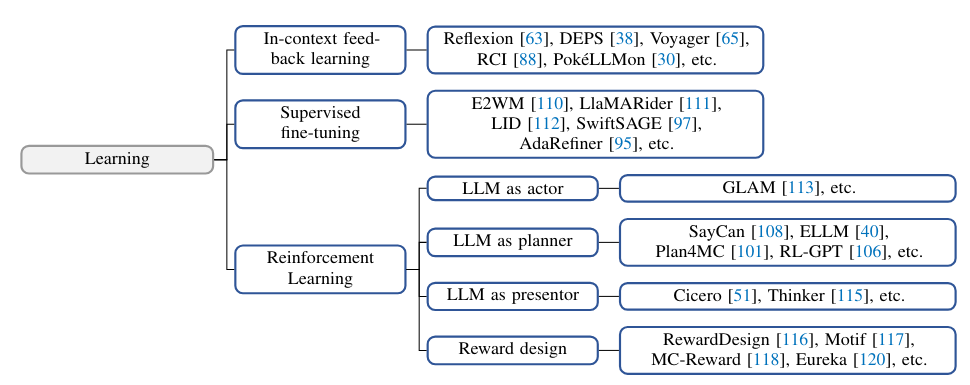

Mind map for the learning module

***

##### Survey on Large Language Model-Enhanced Reinforcement Learning: Concept, Taxonomy, and Methods 

- Paper Link: [arXiv 2403.00282](https://arxiv.org/abs/2404.00282)
- Overview: 

Framework of LLM-enhanced RL in classical Agent-Environment interactions, where LLM plays different roles in enhancing RL.

***

#####  The RL and LLM Taxonomy Tree Reviewing Synergies Between Reinforcement Learning and Large Language Models

- Paper Link: [arXiv 2402.01874](https://arxiv.org/abs/2402.01874) 

- Overview:

    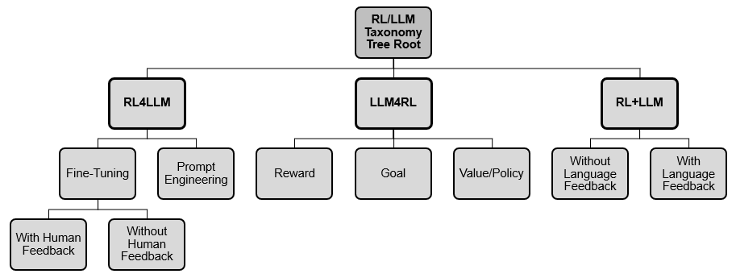

    ​	This study proposes a novel taxonomy of three main classes based on how RL and LLMs interact with each other:

    - RL4LLM: RL is used to improve the performance of LLMs on tasks related to Natural Language Processing.
    - LLM4RL: An LLM assists the training of an RL model that performs a task not inherently related to natural language.
    - RL+LLM: An LLM and an RL agent are embedded in a common planning framework without either of them contributing to training or fine-tuning of the other.

***

## LLM RL Papers

##### Language-Conditioned Offline RL for Multi-Robot Navigation

- Paper Link: [arXiv2407.20164](https://arxiv.org/abs/2407.20164), [Homepage](https://sites.google.com/view/llm-marl)
- Overview:

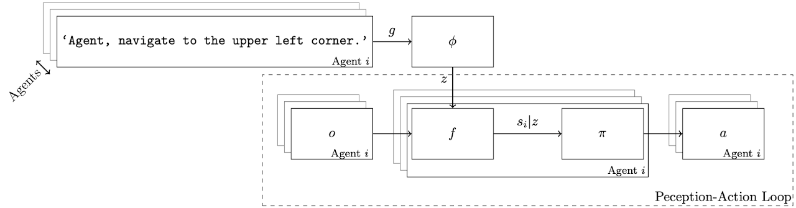

The proposed multi-robot model architecture. Each agent receives a different natural language task and a local observation. They summarize each natural language task g~i~  into a latent representation z~i~  , using an LLM. The function *f* is a graph neural network that encodes local observations o~1~, o~2~, . . . and task embeddings z~1~, z~2~, . . . into a task-dependent state representation s~i~|z for each agent *i*. They learn a local policy *π* conditioned on the state-task representation. Functions *π, f* are learned entirely from a fixed dataset using offline RL. Because they compute z~i~ only once per task, the LLM is not part of the perception-action loop, allowing the policy to act quickly.

***

##### LLM-Empowered State Representation for Reinforcement Learning

- Paper Link: [arXiv2407.15019](https://arxiv.org/abs/2407.13237), [Homepage](https://github.com/thu-rllab/LESR)
- Overview:

Conventional state representations in reinforcement learning often omit critical task-related details, presenting a significant challenge for value networks in establishing accurate mappings from states to task rewards. Traditional methods typically depend on extensive sample learning to enrich state representations with task-specific information, which leads to low sample efficiency and high time costs. Recently, surging knowledgeable large language models (LLMs) have provided promising substitutes for prior injection with minimal human intervention. Motivated by this, we propose LLM-Empowered State Representation (LESR), a novel approach that utilizes LLM to autonomously generate task-related state representation codes which help to enhance the continuity of network mappings and facilitate efficient training. Experimental results demonstrate LESR exhibits high sample efficiency and outperforms state-of-the-art baselines by an average of 29% in accumulated reward in Mujoco tasks and 30% in success rates in Gym-Robotics tasks.

***

##### iLLM-TSC: Integration reinforcement learning and large language model for traffic signal control policy improvement

- Paper Link: [arXiv2407.06025](https://arxiv.org/abs/2407.06025), [Homepage](https://github.com/Traffic-Alpha/iLLM-TSC)
- Overview:

The authors introduce a framework called iLLM-TSC that combines LLM and an RL agent for TSC. This framework initially employs an RL agent to make decisions based on environmental observations and policies learned from the environment, thereby providing preliminary actions. Subsequently, an LLM agent refines these actions by considering real-world situations and leveraging its understanding of complex environments. This approach enhances the TSC system’s adaptability to real-world conditions and improves the overall stability of the framework. Details regarding the RL agent and LLM agent components are provided in the following sections.

***

##### Large Language Model Guided Reinforcement Learning Based Six-Degree-of-Freedom Flight Control

- Paper Link: [IEEE 2406 2024.3411015](https://ieeexplore.ieee.org/abstract/document/10551749)
- Overview:

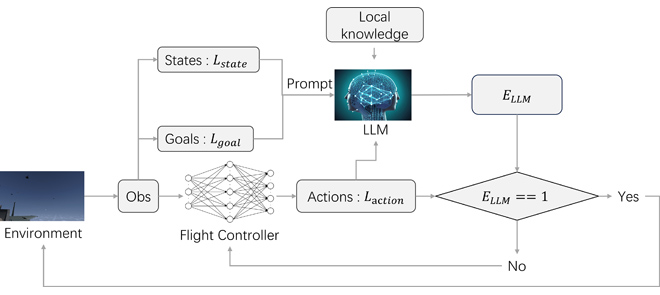

LLM-Guided reinforcement learning framework. 
This paper proposes an LLM-guided deep reinforcement learning framework for IFC, which utilizes LLM-guided deep reinforcement learning to achieve intelligent flight control under limited computational resources. LLM provides direct guidance during training based on local knowledge, which improves the quality of data generated in agent-environment interaction within DRL, expedites training, and offers timely feedback to agents, thereby partially mitigating sparse reward issues. Additionally, they present an effective reward function to comprehensively balance the aircraft coupling control to ensure stable, flexible control. Finally, simulations and experiments show that the proposed techniques have good performance, robustness, and adaptability across various flight tasks, laying a foundation for future research in the intelligent air combat decision-making domain.

***

##### Agentic Skill Discovery

- Paper Link: [arXiv 2405.15019](https://arxiv.org/abs/2405.15019)，[Homepage](https://agentic-skill-discovery.github.io/)
- Overview:

Agentic Skill Discovery gradually acquires contextual skills for table manipulation.

Contextual skill acquisition loop of ASD. Given the environment setup and the robot’s current abilities, an LLM continually *proposes* tasks for the robot to complete, and the successful completion will be collected as acquired skills, each with several neural network variants (*options*). 

***

##### HighwayLLM: Decision-Making and Navigation in Highway Driving with RL-Informed Language Model

- Paper Link: [arXiv 2405.13547](https://arxiv.org/abs/2405.13547)
- Overview:

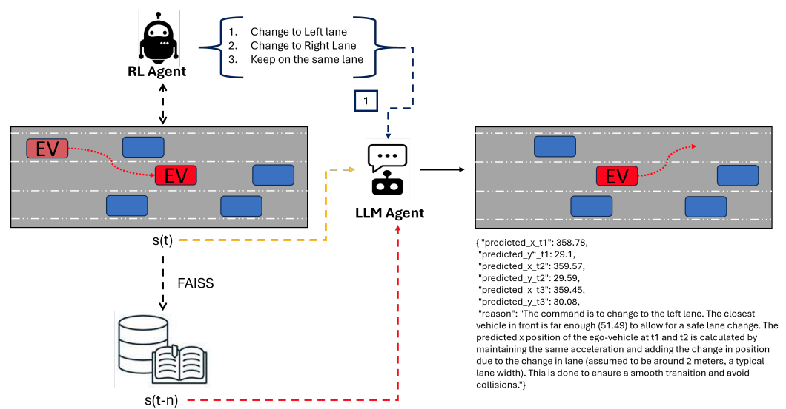

LLM-based vehicle trajectory planning structure: The RL agent observes the traffic (surrounding vehicles) and provides a high-level action for a lane change. Then, the LLM agent retrieves the highD dataset by using FAISS and provides the next three trajectory points.

***

##### LEAGUE++: EMPOWERING CONTINUAL ROBOT LEARNING THROUGH GUIDED SKILL ACQUISITION WITH LARGE LANGUAGE MODELS

- Paper Link:  https://openreview.net/forum?id=xXo4JL8FvV, [Homepage](https://sites.google.com/view/continuallearning)
- Overview:

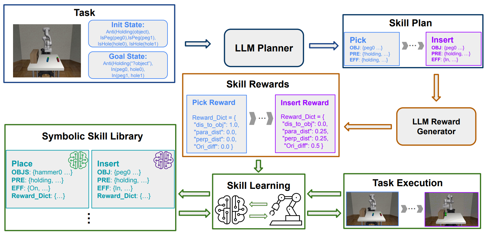

The authors present a framework that utilizes LLMs to guide continual learning. They integrated LLMs to handle task decomposition and operator creation for TAMP, and generate dense rewards for RL skill learning, which can achieve online autonomous learning for long-horizon tasks. They also use a semantic skills library to enhance learning efficiency for new skills.

***

##### Knowledgeable Agents by Offline Reinforcement Learning from Large Language Model Rollouts

- Paper Link: [arXiv 2404.09248](https://arxiv.org/abs/2404.09248), 
- Overview:

Overall procedure of KALM, consisting of three key modules: 
(A) LLM grounding module that grounds LLM in the environment and aligns LLM with inputs of environmental data
(B) Rollout generation module that prompts the LLM to generate data for novel skills
(C) Skill Acquisition module that trains the policy with offline RL. Finally, KALM derives a policy that trained on both offline data and imaginary data. 

***

##### Enhancing Autonomous Vehicle Training with Language Model Integration and Critical Scenario Generation

- Paper Link: [arXiv 2404.08570](https://arxiv.org/abs/2404.08570), 
- Overview:

A architecture diagram mapping out the various components of CRITICAL. The framework first sets up an environment configuration based on typical real-world traffic from the highD dataset. These configurations are then leveraged to generate Highway Env scenarios. At the end of each episode, the authors collect data including failure reports, risk metrics, and rewards, repeating this process multiple times to gather a collection of configuration files with associated scenario risk assessments. To enhance RL training, the authors analyze a distribution of configurations based on risk metrics, identifying those conducive to critical scenarios. The authors then either directly use these configurations for new scenarios or prompt an LLM to generate critical scenarios.

***

##### Long-horizon Locomotion and Manipulation on a Quadrupedal Robot with Large Language Model

- Paper Link: [arXiv 2404.05291](https://arxiv.org/abs/2404.05291)
- Overview:

Overview of the hierarchical system for long-horizon loco-manipulation task. The system is built up from a reasoning layer for task decomposition (yellow) and a controlling layer for skill execution (purple). Given the language description of the long-horizon task (top), a cascade of LLM agents perform high-level task planning and generate function calls of parameterized robot skills. The controlling layer instantiates the mid-level motion planning and low-level controlling skills with RL. 

***

##### Yell At Your Robot: Improving On-the-Fly from Language Corrections

- Paper Link: [arXiv 2403.12910](https://arxiv.org/abs/2403.12910) , [Homepage](https://yay-robot.github.io/)

- Framework Overview: 

    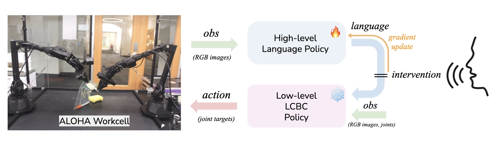

    ​	The authors operate in a hierarchical setup where a high-level policy generates language instructions for a low-level policy that executes the corresponding skills. During deployment, humans can intervene through corrective language commands, temporarily overriding the high-level policy and directly influencing the low-level policy for on-the-fly adaptation. These interventions are then used to finetune the high-level policy, improving its future performance.

    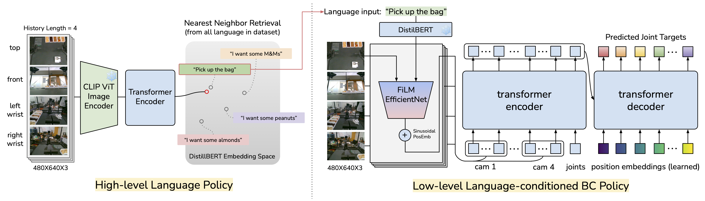

    ​	The system processes RGB images and the robot's current joint positions as inputs, outputting target joint positions for motor actions. The high-level policy uses a Vision Transformer to encode visual inputs and predicts language embeddings. The low-level policy uses ACT, a Transformer-based model to generate precise motor actions for the robot, guided by language instructions. This architecture enables the robot to interpret commands like “Pick up the bag” and translate them into targeted joint movements.

***

##### SRLM: Human-in-Loop Interactive Social Robot Navigation with Large Language Model and Deep Reinforcement Learning 

- Paper Link: [arXiv 2403.15648](https://arxiv.org/abs/2403.15648)
- Overview:

SRLM architecture: SRLM is implemented as a human-in-loop interactive social robot navigation framework, which executes human commands based on LM-based planner, feedback-based planner, and DRL-based planner incorporating. Firstly, users’ requests or real-time feedbacks are processed or replanned to high-level task guidance for three action executors via LLM. Then, the image-to-text encoder and spatio-temporal graph HRI encoder convert robot local observation information to features as LNM and RLNM input, which generate RL-based action, LM-based action, and feedback-based action. Lastly, the above three actions are adaptively fused by a low-level execution decoder as the robot behavior output of SRLM.

***

##### EnvGen: Generating and Adapting Environments via LLMs for Training Embodied Agents

- Paper Link: [arXiv 2403.12014](https://arxiv.org/abs/2403.12014) , [Homepage](https://envgen-llm.github.io/)

- Framework Overview: 

    

    ​    In EnvGen framework, the authors generate multiple environments with an LLM to let the agent learn different skills effectively, with the N-cycle training cycles, each consisting of the following four steps. 

    ​    **Step 1:** provide an LLM with a prompt composed of four components (*i.e*., task description, environment details, output template, and feedback from the previous cycle), and ask the LLM to fill the template and output various environment configurations that can be used to train agents on different skills. 

    ​    **Step 2:** train a small RL agent in the LLM-generated environments. 

    ​    **Step 3:** train the agent in the original environment to allow for better generalization and then measure the RL agent’s training progress by letting it explore the original environment. 

    ​    **Step 4:** provide the LLM with the agent performance from the original environment (measured in step 3) as feedback for adapting the LLM environments in the next cycle to focus on the weaker performing skills.

- Review:
        The highlight of this paper is that it uses LLM to design initial training environment conditions, which helps the RL agent learn the strategy of long-horizon tasks more quickly. This is a concept of decomposing long-horizon tasks into smaller tasks and then retraining, accelerating the training efficiency of RL. It also uses a feedback mechanism that allows LLM to revise the conditions based on the training effect of RL. Only four interactions with LLM are needed to significantly improve the training efficiency of RL and reduce the usage cost of LLM.

***

##### LEAGUE++: EMPOWERING CONTINUAL ROBOT LEARNING THROUGH GUIDED SKILL ACQUISITION WITH LARGE LANGUAGE MODELS

- Paper Link: https://openreview.net/forum?id=xXo4JL8FvV, [Homepage](https://sites.google.com/view/continuallearning)
- Overview:

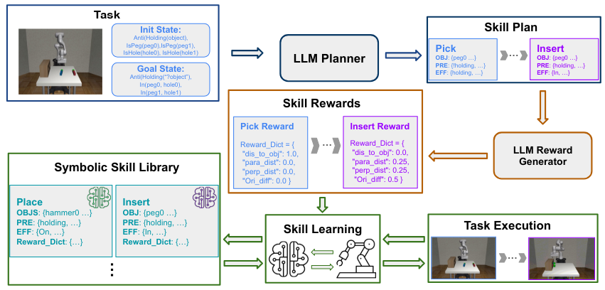

This paper present a framework that utilizes LLMs to guide continual learning. It integrated LLMs to handle task decomposition and operator creation for TAMP, and generate dense rewards for RL skill learning, which can achieve online autonomous learning for long-horizon tasks. It also use a semantic skills library to enhance learning efficiency for new skills.

***

##### RLingua: Improving Reinforcement Learning Sample Efficiency in Robotic Manipulations With Large Language Models

- Paper Link: [arXiv 2403.06420](https://arxiv.org/abs/2403.06420), [homepage](https://rlingua.github.io/)

- Framework Overview:

    

    ​	(a) Motivation: LLMs do not need environment samples and are easy to communicate for non-experts. However, the robot controllers generated directly by LLMs may have inferior performance. In contrast, RL can be used to train robot controllers to achieve high performance. However, the cost of RL is its high sample complexity. (b) Framework: RLingua extracts the internal knowledge of LLMs about robot motion to a coded imperfect controller, which is then used to collect data by interaction with the environment. The robot control policy is trained with both the collected LLM demonstration data and the interaction data collected by the online training policy.

    

    ​	The framework of prompt design with human feedback. The task descriptions and coding guidelines are prompted in sequence. The human feedback is provided after observing the preliminary LLM controller execution process on the robot.

- Review: 

    ​    The highlight of this article is the simultaneous application of LLM and RL to generate training data for online training policy. The control code generated by LLM is also considered a policy, achieving a mathematical form of unity. The main function of this policy is to run on robot and sample data. The focus of this article is on the design of LLM, that is, two types of prompt processes, namely with human feedback and with code template, as well as how to design prompts. The design of the prompts is very detailed and worth learning from.

***

##### RL-GPT: Integrating Reinforcement Learning and Code-as-policy

- Paper Link : [arXiv 2402.19299](https://arxiv.org/abs/2402.19299) ,  [homepage](https://sites.google.com/view/rl-gpt/)

- Framework Overview: 

    

    ​	The overall framework consists of a slow agent (orange) and a fast agent (green). The slow agent decomposes the task and determines “which actions” to learn. The fast agent writes code and RL configurations for low-level execution.

- Review: 

    ​    This framework integrates “Code as Policies”, “RL training”, and “LLM planning”. It first allows the LLM to decompose tasks into actions, which are then further decomposed based on their complexity. Simple actions can be directly coded, while complex actions use a combination of code and RL. The framework also applies a Critic to continuously improve the code and planning. The highlight of this paper is the integration of LLM’s code into RL’s action space for training, and this interactive approach is worth learning from.

***

##### How Can LLM Guide RL? A Value-Based Approach

- Paper Link: [arXiv 2402.16181](https://arxiv.org/abs/2402.16181) , [Homepage](https://github.com/agentification/Language-Integrated-VI)

- Framework Overview: 

    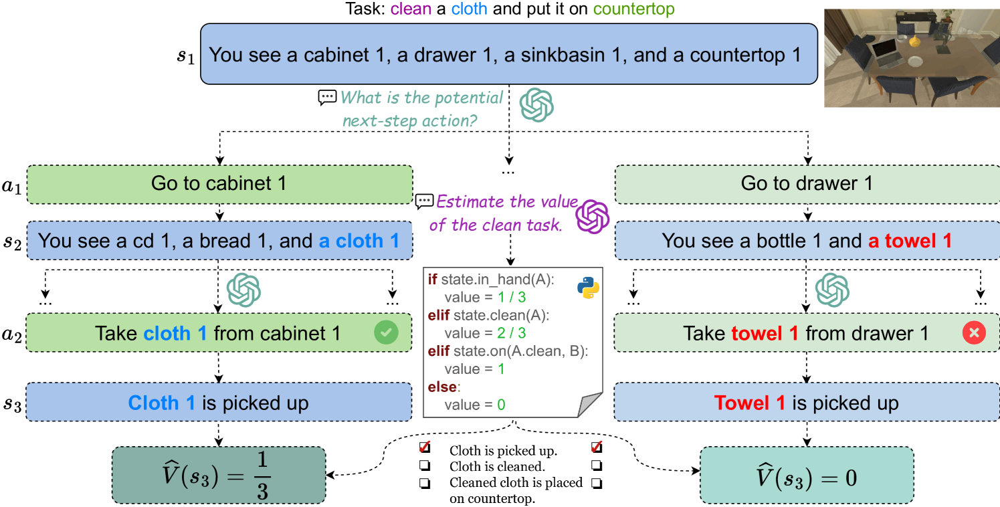

    ​	Demonstration of the SLINVIT algorithm in the ALFWorld environment when N=2 and the tree breadth of BFS is set to k=3. The task is to “clean a cloth and put it on countertop”. The hallucination that LLM faces, i.e., the towel should be taken (instead of cloth), is addressed by the inherent exploration mechanism in our RL framework.

- Review

    ​    The main idea of this article is to assign the task to an LLM, explore extensively within a BFS (Breadth-First Search) framework, generate multiple policies, and propose two ways to estimate value. One approach is based on code, suitable for scenarios where achieving the goal involves fulfilling multiple preconditions. The other approach relies on Monte Carlo methods. Then select the best policy with the highest value, and combine it with RL policy to enhance data sampling and policy improvement.

***

##### PREDILECT: Preferences Delineated with Zero-Shot Language-based Reasoning in Reinforcement Learning

- Paper Link: [arXiv 2402.15420](https://arxiv.org/abs/2402.15420), [Homepage](https://sites.google.com/view/rl-predilect)
- Overview:

An overview of PREDILECT in a social navigation scenario: Initially, a human is shown two trajectories, A and B. They signal their preference for one of the trajectories and provide an additional text prompt to elaborate on their insights. Subsequently, an LLM can be employed for extracting feature sentiment, revealing the causal reasoning embedded in their text prompt, which is processed and mapped to a set of intrinsic values. Finally, both the preferences and the highlighted insights are utilized to more accurately define a reward function. 

***

##### Policy Improvement using Language Feedback Models

- Paper Link : [arXiv 2402.07876](https://arxiv.org/abs/2402.07876) 

- Framework Overview: 

    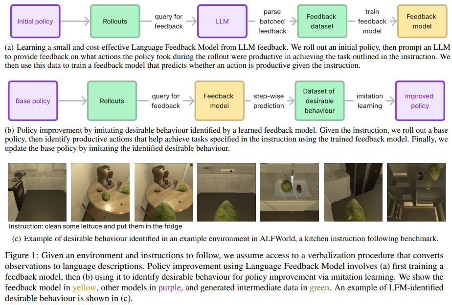

***

##### Natural Language Reinforcement Learning

- Paper Link: [arXiv 2402.07157](https://arxiv.org/abs/2402.07157) 

- Framework Overview: 

    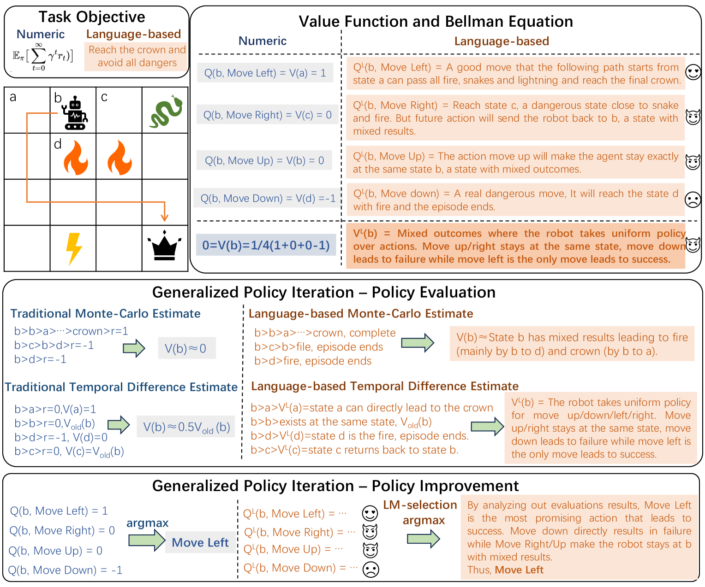

    ​	The authors present an illustrative example of grid-world MDP to show how NLRL and traditional RL differ for task objective, value function, Bellman equation, and generalized policy iteration. In this grid-world, the robot needs to reach the crown and avoid all dangers. They assume the robot policy takes optimal action at each non-terminal state, except a uniformly random policy at state b.

- Review: 

    ​    This paper employs RL as a pipeline for LLM, which is an intriguing research approach. The optimal policy within the framework aligns with the task description. The quality of each state and state-action value depends on how well they align with the task description. The state-action description comprises both the reward and the description of the next state. And the state description is a summary of the all possible state-action description. 

    ​    During the policy estimation step, the state description mimics either the Monte Carlo (MC) or Temporal Difference (TD) methods commonly used in RL. MC focuses on multi-step moves, evaluating based on the final state, while TD emphasizes single-step moves, returning the description of the next state. Finally, the LLM synthesizes all results to derive the current state description. In the policy improvement step, the LLM selects the best state-action pair to make decisions regarding actions.

***

##### Hierarchical Continual Reinforcement Learning via Large Language Model

- Paper Link: [arXiv 2401.15098](https://arxiv.org/abs/2401.15098)

- Framework Overview:

  

  ​	The illustration of the proposed framework. The middle section depicts the internal interactions (**light gray line**) and external interactions (**dark gray line**) in Hi-Core. Internally, the CRL agent is structured in two layers: the high-level policy formulation (**orange**) and the low-level policy learning (**green**). Furthermore, the policy library (**blue**) is constructed to store and retrieve policies. The three surrounding boxes illustrate their internal workflow when the agent encounters new tasks.

- Method Overview: 

    ​	The high level LLM is used to generate a series of goals g_i . The low level is a RL with goal-directed, it needs to generate a policy in response to the goals. Policy library is used to store successful policy. When encountering new tasks, the library can retrieve relevant experience to assist high and low level policy agent.

***

##### True Knowledge Comes from Practice: Aligning LLMs with Embodied Environments via Reinforcement Learning

- Paper Link: [arXiv 2401.14151](https://arxiv.org/abs/2401.14151) , [homepage](https://github.com/WeihaoTan/TWOSOME)

- Framework Overview: 

    

    ​	Overview of how TWOSOME generates a policy using joint probabilities of actions. The color areas in the token blocks indicate the probabilities of the corresponding token in the actions.

- Method Overview: 

    ​	The authors propose *True knoWledge cOmeS frOM practicE*(**TWOSOME**) online framework. It deploys LLMs as embodied agents to efficiently interact and align with environments via RL to solve decision-making tasks w.o. prepared dataset or prior knowledge of the environments. They use the loglikelihood scores of each token provided by LLMs to calculate the joint probabilities of each action and form valid behavior policies.

***

##### AutoRT: Embodied Foundation Models for Large Scale Orchestration of Robotic Agents

- Paper Link: [arXiv 2401.12963](https://arxiv.org/abs/2401.12963) , [Homepage](https://auto-rt.github.io/)

- Framework Overview:

    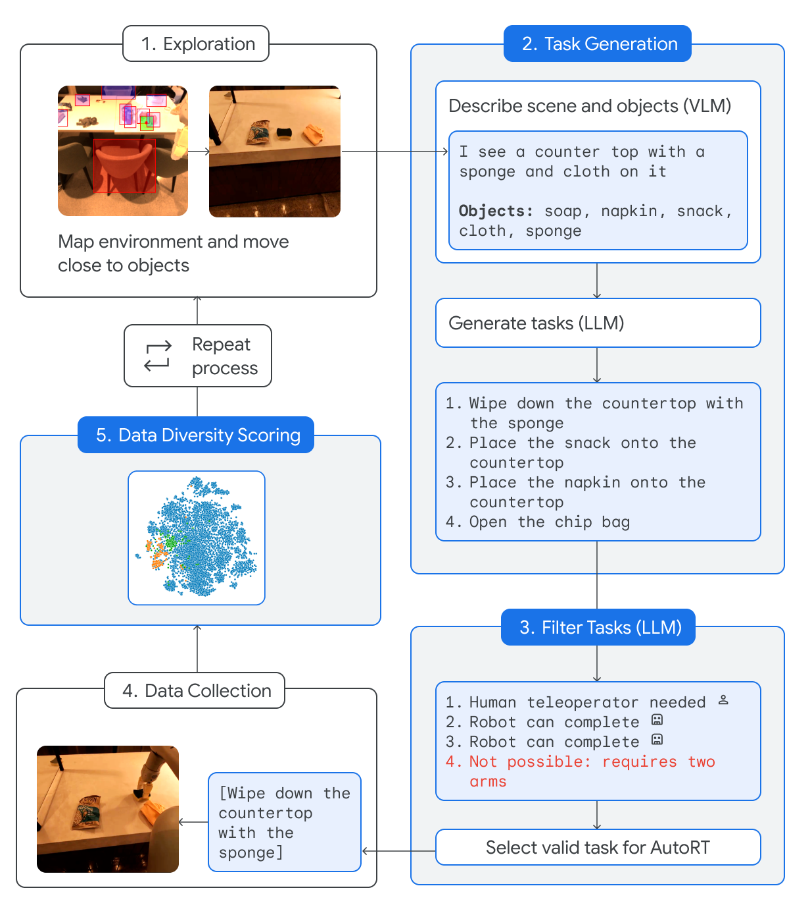

    ​	AutoRT is an exploration into scaling up robots to unstructured "in the wild" settings. The authors use VLMs to do open-vocab description of what the robot sees, then pass that description to an LLM which proposes natural language instructions. The proposals are then critiqued by another LLM using what they call a *robot constitution*, to refine instructions towards safer completable behavior. This lets them run robots in more diverse environments where they do not know the objects the robot will encounter ahead of time, collecting data on self-generated tasks.

- Review: 

    ​	The main contribution of this paper is the design of a framework that uses a Language Learning Model (LLM) to assign tasks to robots based on the current scene and skill. During the task execution phase, various robot learning methods, such as Reinforcement Learning (RL), can be employed. The data obtained during execution is then added to the database. 

    ​	Through this iterative process, and with the addition of multiple robots, the data collection process can be automated and accelerated. This high-quality data can be used for training more robots in the future. This work lays the foundation for training robot learning based on a large amount of real physics data.

***

##### Reinforcement Learning from LLM Feedback to Counteract Goal Misgeneralization

- Paper Link: [arXiv 2401.07181](https://arxiv.org/abs/2401.07181), 

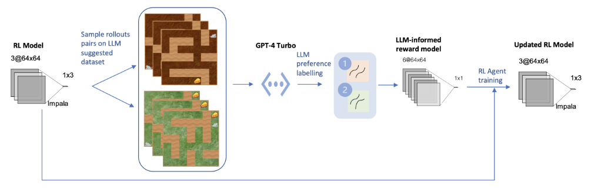

LLM preference modelling and reward model. The RL agent is deployed on the LLM generated dataset and its rollouts are stored. The LLM compares pairs of rollouts and provides preferences, which are used to train a new reward model. The reward model is then integrated to the remaining training timesteps of the agent.

***

##### Auto MC-Reward: Automated Dense Reward Design with Large Language Models for Minecraft

- Paper Link: [arXiv 2312.09238](https://arxiv.org/abs/2312.09238), [Homepage](https://yangxue0827.github.io/auto_mc-reward.html)
- Overview: 

Overview of Auto MC-Reward. Auto MC-Reward consists of three key LLM-based components: Reward Designer, Reward Critic, and Trajectory Analyzer. A suitable dense reward function is iterated through the continuous interaction between the agent and the environment for reinforcement learning training of specific tasks, so that the model can better complete the task. An example of exploring diamond ore is shown in the figure: i) Trajectory Analyzer finds that the agent dies from lava in the failed trajectory, and then gives suggestion for punishment when encountering lava; ii) Reward Designer adopts the suggestion and updates the reward function; iii) The revised reward function passes the review of Reward Critic, and finally the agent avoids the lava by turning left.

***

##### Large Language Model as a Policy Teacher for Training Reinforcement Learning Agents

- Paper Link: [arXiv 2311.13373](https://arxiv.org/abs/2311.13373), [Homepage](https://github.com/ZJLAB-AMMI/LLM4Teach)

- Framework Overview: 

    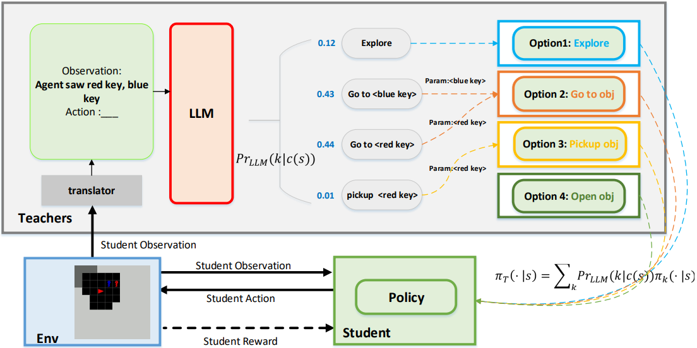

    ​	An illustration of the LLM4Teach framework using the MiniGrid environment as an exemplar. The LLM-based teacher agent responds to observations of the state provided by the environment by offering soft instructions. These instructions take the form of a distribution over a set of suggested actions. The student agent is trained to optimize two objectives simultaneously. 	The first one is to maximize the expected return, the same as in traditional RL algorithms. The other one is to encourage the student agent to follow the guidance provided by the teacher. As the student agent’s expertise increases during the training process, the weight assigned to the second objective gradually decreases over time, reducing its reliance on the teacher.

***

##### Language and Sketching: An LLM-driven Interactive Multimodal Multitask Robot Navigation Framework

- Paper Link: [arXiv 2311.08244](https://arxiv.org/abs/2311.08244) 

- Framework Overview: 

    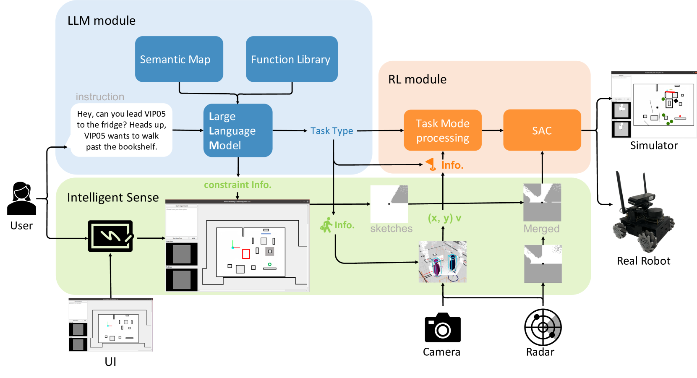

The framework contains an LLM module, an Intelligent Sensing Module, and a Reinforcement Learning Module.

***

##### LLM Augmented Hierarchical Agents

- Paper Link: [arXiv 2311.05596](https://arxiv.org/abs/2311.05596) 

- Framework Overview: 

    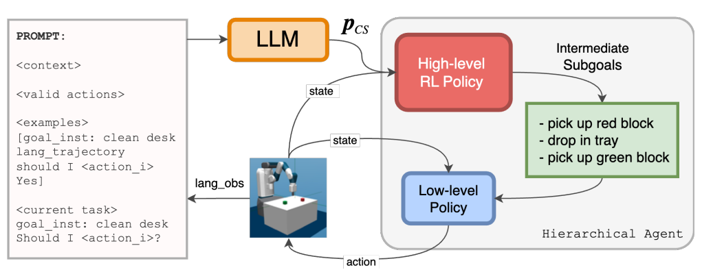

The LLM to guides the high-level policy and accelerates learning. It is prompted with the context, some examples, and the current task and observation. The LLM’s output biases high-level action selection.

***

##### Accelerating Reinforcement Learning of Robotic Manipulations via Feedback from Large Language Models

- Paper Link: [arXiv 2311.02379](https://arxiv.org/abs/2311.02379)
- Overview:

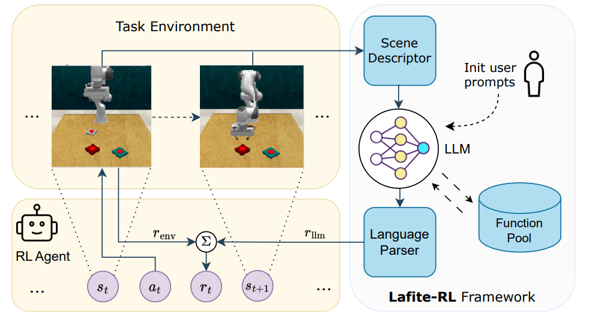

Depiction of proposed Lafite-RL framework. Before learning a task, a user provides designed prompts, including descriptions of the current task background and desired robot’s behaviors, and specifications for the LLM’s missions with several rules respectively. Then, Lafite-RL enables an LLM to “observe” and understand the scene information which includes the robot’s past action, and evaluate the action under the current task requirements. The language parser transforms the LLM response into evaluative feedback for constructing interactive rewards.

***

##### Unleashing the Power of Pre-trained Language Models for Offline Reinforcement Learning

- Paper Link: [arXiv 2310.20587](https://arxiv.org/abs/2310.20587), [Homepage](https://lamo2023.github.io/)
- Overview:

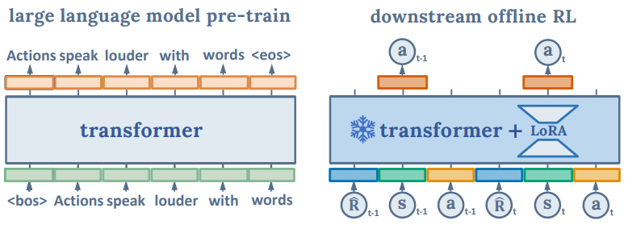

The overview of LaMo. LaMo mainly consists of two stages: (1) pre-training LMs on language tasks, (2) freezing the pre-trained attention layers, replacing linear projections with MLPs, and using LoRA to adapt to RL tasks. The authors also apply the language loss during the offline RL stage as a regularizer.

***

##### Large Language Models as Generalizable Policies for Embodied Tasks

- Paper Link: [arXiv 2310.17722](https://arxiv.org/abs/2310.17722), [Homepage](https://llm-rl.github.io/)
- Overview:

By utilizing Reinforcement Learning together with a pre-trained LLM and maximizing only sparse rewards, it can learn a policy that generalizes to novel language rearrangement tasks. The method robustly generalizes over unseen objects and scenes, novel ways of referring to objects, either by description or explanation of an activity; and even novel descriptions of tasks, including variable number of rearrangements, spatial descriptions, and conditional statements.

***

##### Eureka: Human-Level Reward Design via Coding Large Language Models

- Paper Link: [arXiv 2310.12931](https://arxiv.org/abs/2310.12931) , [Homepage](https://eureka-research.github.io/)

- Framework Overview: 

    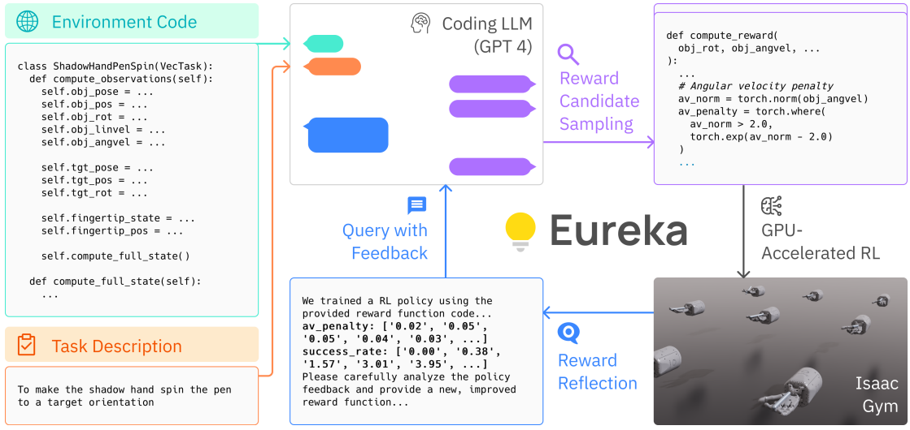

EUREKA takes unmodified environment source code and language task description as context to zero-shot generate executable reward functions from a coding LLM. Then, it iterates between reward sampling, GPU-accelerated reward evaluation, and reward reflection to progressively improve its reward outputs.

- Review

    The LLM in this article is used to design the reward function for RL. The main focus is on how to create a well-designed reward function. There are two approaches:

    1. **Evolutionary Search**: Initially, a large number of reward functions are generated, and their evaluation is done using hardcoded methods.
    2. **Reward Reflection**:  During training, intermediate reward variables are saved and fed back to LLM, allowing improvements to be made based on the original reward function.

    The first approach leans more toward static analysis, while the second approach emphasizes dynamic analysis. By combining these two methods, one can select and optimize the best reward function.

***

##### AMAGO: Scalable In-Context Reinforcement Learning for Adaptive Agents

- Paper Link: [arXiv 2310.09971](https://arxiv.org/abs/2310.09971), [Homepage](https://ut-austin-rpl.github.io/amago/)
- Overview:

In-context RL techniques solve memory and meta-learning problems by using sequence models to infer the identity of unknown environments from test-time experience. AMAGO addresses core technical challenges to unify the performance of end-to-end off-policy RL with long-sequence Transformers in order to push memory and adaptation to new limits.

***

##### LgTS: Dynamic Task Sampling using LLM-generated sub-goals for Reinforcement Learning Agents

- Paper Link: [arXiv 2310.09454](https://arxiv.org/pdf/2310.09454.pdf)
- Overview: 

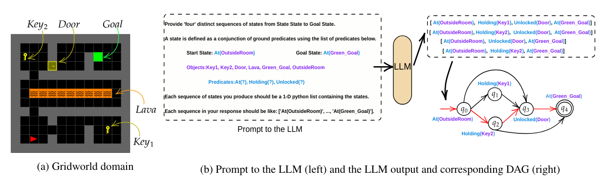

(a) Gridworld domain and descriptors. The agent (red triangle) needs to collect one of the keys and open the door to reach the goal;
(b) The prompt to the LLM that contains information about the number of paths n expected from the LLM and the symbolic information such as the entities, predicates and the high-level initial and goal states of the of the environment (no assumptions if the truth values of certain predicates are unknown). The prompt from the LLM is a set of paths in the form of ordered lists. The paths are converted in the form of a DAG. The path chosen by LgTS is highlighted in red in the DAG in Fig. b

****

##### Octopus: Embodied Vision-Language Programmer from Environmental Feedback

- Paper Link: [arXiv 2310.08588](https://arxiv.org/abs/2310.08588), [Homepage](https://choiszt.github.io/Octopus/)
- Overview:

 GPT-4 perceives the environment through the **environmental message** and produces anticipated plans and code in accordance with the detailed **system message**. This code is subsequently executed in the simulator, directing the agent to the subsequent state. For each state, the authors gather the environmental message, wherein **observed objects** and **relations** are substituted by egocentric images to serve as the training input. The response from GPT-4 acts as the training output. Environmental feedback, specifically the determination of whether each target state is met, is documented for RLEF training.

The provided image depicts a comprehensive pipeline for data collection and training. In the **Data Collection Pipeline**, environmental information is captured, parsed into a scene graph, and combined to generate **environment message** and **system message**. These messages subsequently drive agent control, culminating in executable code. For the **Octopus Training Pipeline**, the agent's vision and code are input to the Octopus model for training using both **SFT** and **RLEF** techniques. The accompanying text emphasizes the importance of a well-structured system message for GPT-4's effective code generation and notes the challenges faced due to errors, underscoring the adaptability of the model in handling a myriad of tasks. In essence, the pipeline offers a holistic approach to agent training, from environment understanding to action execution.

***

##### Motif: Intrinsic Motivation from Artificial Intelligence Feedback

- Paper Link: [arXiv 2310.00166](https://arxiv.org/abs/2310.00166), [Homepage](https://github.com/facebookresearch/motif)
- Overview: 

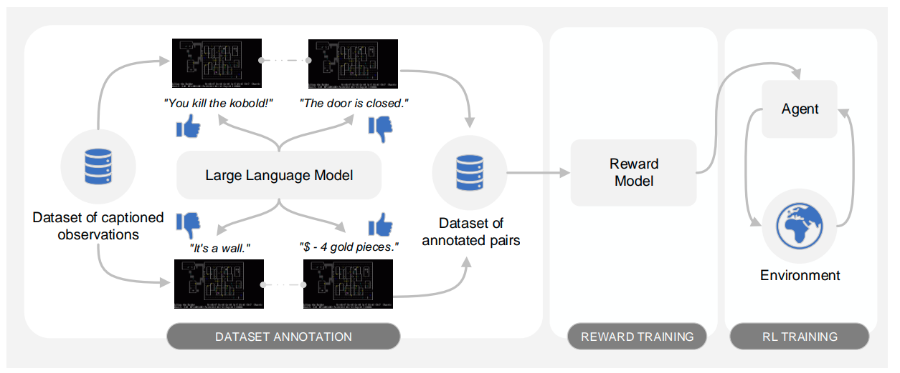

A schematic representation of the three phases of Motif. In the first phase, dataset annotation, the authors extract preferences from an LLM over pairs of captions, and save the corresponding pairs of observations in a dataset alongside their annotations. In the second phase, reward training, the authors distill the preferences into an observation-based scalar reward function. In the third phase, RL training, the authors train an agent interactively with RL using the reward function extracted from the preferences, possibly together with a reward signal coming from the environment.

***

##### Text2Reward: Automated Dense Reward Function Generation for Reinforcement Learning

- Paper Link: [arXiv 2309.11489](https://arxiv.org/abs/2309.11489)

- Framework Overview:

    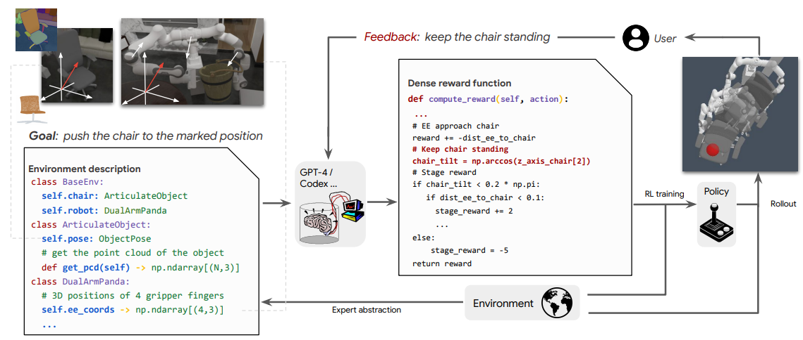

    ​	Expert Abstraction provides an abstraction of the environment as a hierarchy of Pythonic classes. *User Instruction* describes the goal to be achieved in natural language. *User Feedback* allows users to summarize the failure mode or their preferences, which are used to improve the reward code.

***

##### State2Explanation: Concept-Based Explanations to Benefit Agent Learning and User Understanding

- Paper Link: [arXiv 2309.12482](https://arxiv.org/abs/2309.12482)
- Overview:

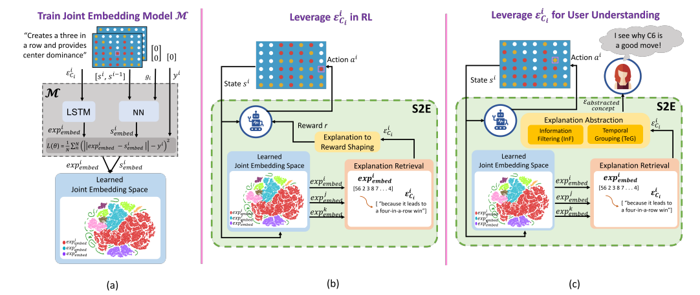

S2E framework involves (a) learning a joint embedding model M from which epsilon is extracted and utilized 
(b) during agent training to inform reward shaping and benefit agent learning 
(c) at deployment to provide end-users with epsilon for agent actions

***

##### Self-Refined Large Language Model as Automated Reward Function Designer for Deep Reinforcement Learning in Robotics

- Paper Link: [arXiv 2309.06687](https://arxiv.org/abs/2309.06687) 

- Framework Overview: 

    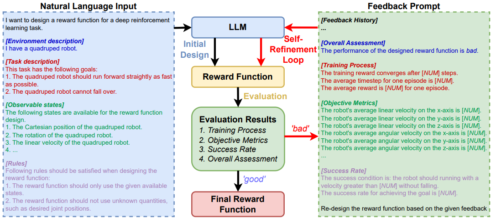

    ​    The proposed self-refine LLM framework for reward function design. It consists of three steps: initial design, evaluation, and self-refinement loop. A quadruped robot forward running task is used as an example here. 

***

##### RLAdapter: Bridging Large Language Models to Reinforcement Learning in Open Worlds

- Paper Link: [arXiv 2309.17176](https://arxiv.org/abs/2309.17176v1)

- Framework Overview:

    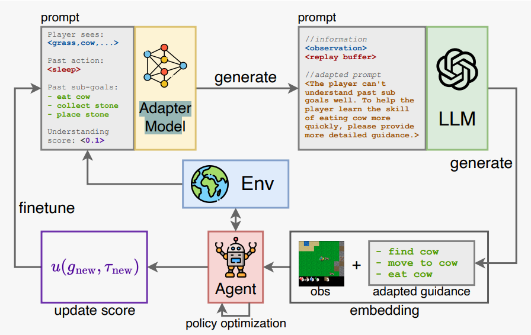

    ​    Overall framework of RLAdapter. In addition to receiving inputs from the environment and historical information, the prompt of the adapter model incorporates an understanding score. This score computes the semantic similarity between the agent’s recent actions and the sub-goals suggested by the LLM, determining whether the agent currently comprehends the LLM’s guidance accurately. Through the agent’s feedback and continuously fine-tuning the adapter model, it can keep the LLM always remains attuned to the actual circumstances of the task. This, in turn, ensures that the provided guidance is the most appropriate for the agents’ prioritized learning.

- Review:

    The paper develop the RLAdapter framework, apart from RL and LLM, it also includes additionally an Adapter model. 

***

##### ExpeL: LLM Agents Are Experiential Learners

- Paper Link: [arXiv 2308.10144](https://arxiv.org/abs/2308.10144), [Homepage](https://andrewzh112.github.io/#expel)
- Overview: 

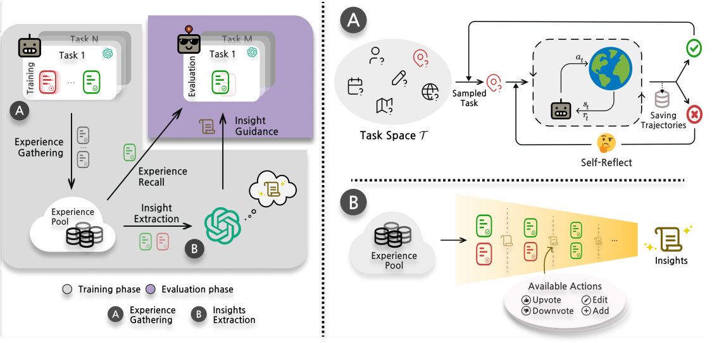

Left: ExpeL operates in three stages: (1) Collection of success and failure experiences into a pool. (2) Extraction/abstraction of cross-task knowledge from these experiences. (3) Application of the gained insights and recall of past successes in evaluation tasks. 
Right: (A) Illustrates the experience gathering process via Reflexion, enabling task reattempt after self-reflection on failures. (B) Illustrates the insight extraction step. When presented with success/failure pairs or a list of L successes, the agent dynamically modifies an existing list of insights using operations ADD, UPVOTE, DOWNVOTE, and EDIT. This process has an emphasis on extracting prevalent failure patterns or best practices.

***

##### Language to Rewards for Robotic Skill Synthesis

- Paper Link: [arXiv 2306.08647](https://arxiv.org/abs/2306.08647), [Homepage](https://language-to-reward.github.io/)
- Overview:

Detailed dataflow of the Reward Translator. A Motion Descriptor LLM takes the user input and describe the user-specified motion in natural language, and a Reward Coder translates the motion into the reward parameters

***

##### Learning to Model the World with Language

- Paper Link: [arXiv2308.01399](https://arxiv.org/abs/2308.01399), [Homepage](https://dynalang.github.io/)
- Overview: 

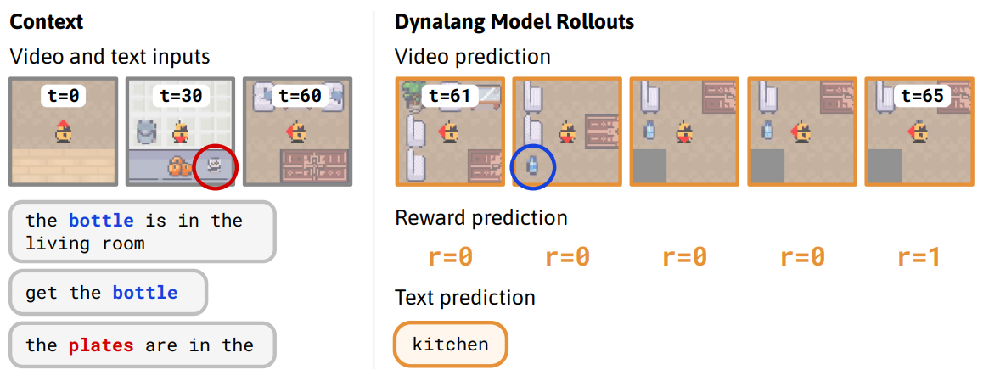

Dynalang learns to use language to make predictions about future (text + image) observations and rewards, which helps it solve tasks. Here, the authors show real model predictions in the HomeGrid environment. The agent has explored various rooms while receiving video and language observations from the environment. From the past text “the bottle is in the living room”, the agent predicts at timesteps 61-65 that it will see the bottle in the final corner of the living room. From the text ‘get the bottle” describing the task, the agent predicts that it will be rewarded for picking up the bottle. The agent can also predict future text observations: given the prefix “the plates are in the” and the plates it observed on the counter at timestep 30, the model predicts the most likely next token is “kitchen.”

***

##### Enabling Intelligent Interactions between an Agent and an LLM: A Reinforcement Learning Approach

- Paper Link: [arXiv 2306.03604](https://arxiv.org/abs/2306.03604), [Homepage](https://github.com/ZJLAB-AMMI/LLM4RL)
- Overview:

An overview of the Planner-Actor-Mediator paradigm and an example of the interactions. At each time step, the mediator takes the observation o_t as input and decides whether to ask the LLM planner for new instructions or not. When the asking policy decides to ask, as demonstrated with a red dashed line, the translator converts o_t into text descriptions, and the planner outputs a new plan accordingly for the actor to follow. On the other hand, when the mediator decides to not ask, as demonstrated with a green dashed line, the mediator returns to the actor directly, telling it to continue with the current plan.

***

##### Reward Design with Language Models

- Paper Link: [arXiv 2303.00001](https://arxiv.org/abs/2303.00001)

- Framework Overview: 

    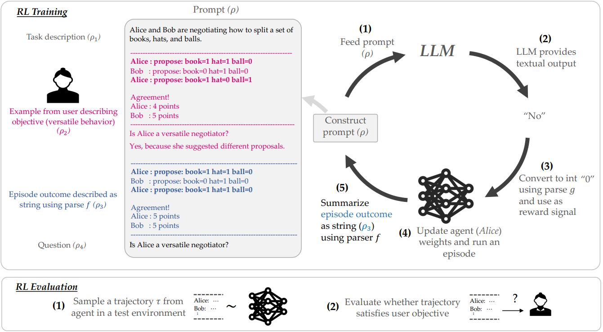

    ​	Depiction of the framework on the DEAL OR NO DEAL negotiation task. A user provides an example and explanation of desired negotiating behavior (e.g., versatility) before training. During training, (1) they provide the LLM with a task description, a user’s description of their objective, an outcome of an episode that is converted to a string, and a question asking if the outcome episode satisfies the user objective. (2-3) They then parse the LLM’s response back into a string and use that as the reward signal for the Alice the RL agent. (4) Alice updates their weights and rolls out a new episode. (5) They parse the episode outcome int a string and continue training. During evaluation, they sample a trajectory from Alice and evaluate whether it is aligned with the user’s objective.

***

##### Skill Reinforcement Learning and Planning for Open-World Long-Horizon Tasks

- Paper Link: [arXiv 2303.16563](https://arxiv.org/abs/2303.16563) , [Homepage](https://sites.google.com/view/plan4mc)

- Framework Overview: 

    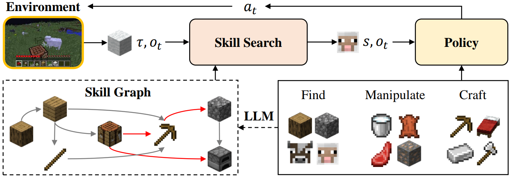

    ​	The authors categorize the basic skills in Minecraft into three types: Findingskills, Manipulation-skills, and Crafting-skills. The authors train policies to acquire skills with reinforcement learning. With the help of LLM, the authors extract relationships between skills and construct a skill graph in advance, as shown in the dashed box. During online planning, the skill search algorithm walks on the pre-generated graph, decomposes the task into an executable skill sequence, and interactively selects policies to solve complex tasks.

- Review

    ​	The highlight of the article lies in its use of LLM to generate skill graph,  thereby clarifying the sequential relationship between skills. When a task is input, the framework searches the skill graph using DFS to determine the skill to be selected at each step. RL is responsible for executing the skill and updating the state, iterating this process to break down complex tasks into manageable segments. 

    ​	Areas for improvement in the framework include:

     1. Currently, humans need to provide the available skills first. In the future, the framework should have ability to lean new skills autonomously.
     2. The application of LLM in the framework is mainly to build relationships between skills. Maybe this could potentially be achieved through hard coding, such as querying a Minecraft library to generate a skill graph.

***

##### RE-MOVE: An Adaptive Policy Design for Robotic Navigation Tasks in Dynamic Environments via Language-Based Feedback

- Paper Link: [arXiv 2303.07622](https://arxiv.org/abs/2303.07622), [Homepage](https://gamma.umd.edu/researchdirections/crowdmultiagent/remove/)
- Overview:

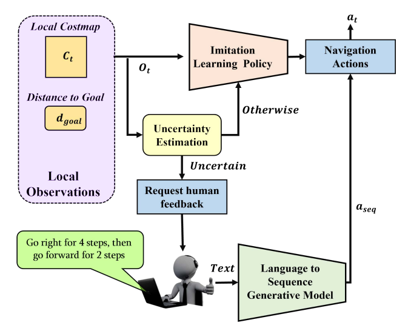

***

##### Natural Language-conditioned Reinforcement Learning with Inside-out Task Language Development and Translation

- Paper Link: [arXiv 2302.09368](https://arxiv.org/abs/2302.09368)
- Overview: 

Natural Language-conditioned reinforcement learning (RL) enables the agents to follow human instructions. Previous approaches generally implemented language-conditioned RL by providing human instructions in natural language (NL) and training a following policy. In this outside-in approach, the policy needs to comprehend the NL and manage the task simultaneously. However, the unbounded NL examples often bring much extra complexity for solving concrete RL tasks, which can distract policy learning from completing the task. To ease the learning burden of the policy, the authors investigate an inside-out scheme for natural language-conditioned RL by developing a task language (TL) that is task-related and unique. The TL is used in RL to achieve highly efficient and effective policy training. Besides, a translator is trained to translate NL into TL. They implement this scheme as TALAR (TAsk Language with predicAte Representation) that learns multiple predicates to model object relationships as the TL. Experiments indicate that TALAR not only better comprehends NL instructions but also leads to a better instruction-following policy that improves 13.4% success rate and adapts to unseen expressions of NL instruction. The TL can also be an effective task abstraction, naturally compatible with hierarchical RL.

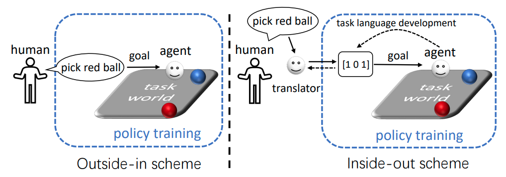

An illustration of OIL and IOL schemes in NLC-RL. 
Left: OIL directly exposes the NL instructions to the policy. 
Right: IOL develops a task language, which is task-related and a unique representation of NL instructions. 
The solid lines represent instruction following process, while the dashed lines represent TL development and translation.

***

##### Guiding Pretraining in Reinforcement Learning with Large Language Models

- Paper Link: [arXiv 2302.06692](https://arxiv.org/abs/2302.06692) , [Homepage](https://github.com/yuqingd/ellm)

- Framework Overview: 

    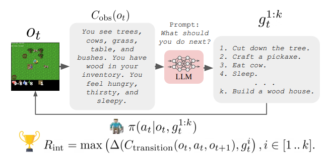

    ​	ELLM uses a pretrained large language model (LLM) to suggest plausibly useful goals in a task-agnostic way. Building on LLM capabilities such as context-sensitivity and common-sense, ELLM trains RL agents to pursue goals that are likely meaningful without requiring direct human intervention.

    ​	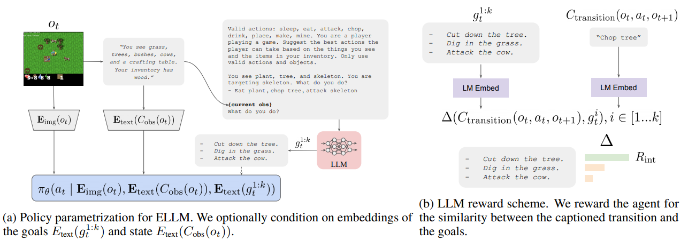

    ​    ELLM uses GPT-3 to suggest adequate exploratory goals and SentenceBERT embeddings to compute the similarity between suggested goals and demonstrated behaviors as a form of intrinsically-motivated reward.

- Review: 

    ​    This paper is one of the earliest to use LLM for RL planning goals. The ELLM framework provides the current environmental information and available actions to the LLM, allowing it to design multiple reasonable goals based on common sense. RL then executes one of these goals. The reward function is determined based on the similarity of the embeddings of the goals and states. Since the embeddings are also generated by a  SentenceBERT model, it can also be said that the reward is generated by the LLM.

***

##### Grounding Large Language Models in Interactive Environments with Online Reinforcement Learning

- Paper Link: [arXiv 2302.02662](https://arxiv.org/abs/2302.02662) , [Homepage](https://github.com/flowersteam/Grounding_LLMs_with_online_RL)

- Framework Overview: 

    

    ​    The GLAM method: the authors use an LLM as agent policy in an interactive textual RL environment (BabyAI-Text) where the LLM is trained to achieve language goals using online RL (PPO), enabling functional grounding. (a) BabyAI-Text provides a goal description for the current episode as well as a description of the agent observation and a scalar reward for the current step. (b) At each step, they gather the goal description and the observation in a prompt sent to our LLM. (c) For each possible action, they use the encoder to generate a representation of the prompt and compute the conditional probability of tokens composing the action given the prompt. Once the probability of each action is estimated, they compute a softmax function over these probabilities and sample an action according to this distribution. That is, the LLM is our agent policy. (d) They use the reward returned by the environment to finetune the LLM using PPO. For this, they estimate the value of the current observation by adding a value head on top of our LLM. Finally, they backpropagate the gradient through the LLM (and its value head).

- Review: 

  ​    This article uses BabyAI-Text to convert the goal and observation in Gridworld into text descriptions, which can then be transformed into prompts input to the LLM. The LLM outputs the probability of actions, and then the action probabilities output by the LLM, the value estimation obtained through MLC, and the reward are input into PPO for training. Eventually, the Agent outputs an appropriate action. In the experiment, the authors used the GFlan-T5 model, and after 250k steps of training, they achieved a success rate of 80%, which is a significant improvement compared to other methods.

***

##### Read and Reap the Rewards: Learning to Play Atari with the Help of Instruction Manuals

- Paper Link: [arXiv 2302.04449](https://arxiv.org/pdf/2302.04449)
- Overview:

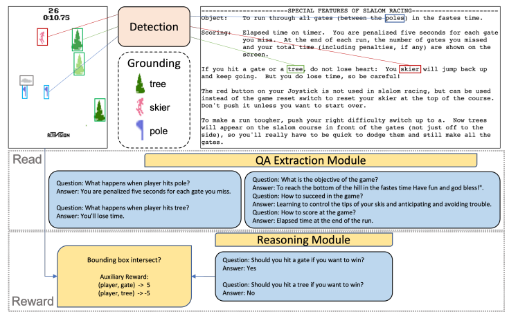

An overview of  Read and Reward framework. The system receives the current frame in the environment, and the instruction manual as input. After object detection and grounding, the QA Extraction Module extracts and summarizes relevant information from the manual, and the Reasoning Module assigns auxiliary rewards to detected in-game events by reasoning with outputs from the QA Extraction Module. The “Yes/No” answers are then mapped to +5/ − 5 auxiliary rewards.

***

##### Collaborating with language models for embodied reasoning

- Paper Link: [arXiv 2302.00763](https://arxiv.org/abs/2302.00763) 

- Framework Overview: 

    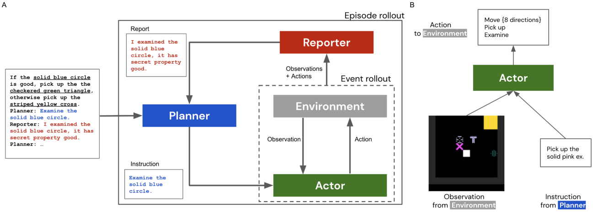

    ​    A. Schematic of the Planner-Actor-Reporter paradigm and an example of the interaction among them. B. Observation and action space of the PycoLab environment.

- Review:

    The framework presented in this paper is simple yet clear, and it is one of the early works on using LLM for RL policy. In this framework, the Planner is an LLM, while the Reporter and Actor are RL components. The task requires the role to first inspect the properties of an item, and then select an item with the “good” property. The framework starts with the Planner, informing it of the task description and historical execution records. The Planner then chooses an action for the Actor. After the Actor executes the action, a result is obtained. The Reporter observes the environment and provides feedback to the Planner, and this process repeats.

***

##### Transformers are Sample-Efficient World Models

- Paper Link: [arXiv 2209.00588](https://arxiv.org/abs/2209.00588), [Homepage](https://github.com/eloialonso/iris)

***

##### Inner Monologue: Embodied Reasoning through Planning with Language Models

- Paper Link: [arXiv 2207.05608](https://arxiv.org/abs/2207.05608), [Homepage](https://innermonologue.github.io/)
- Overview: 

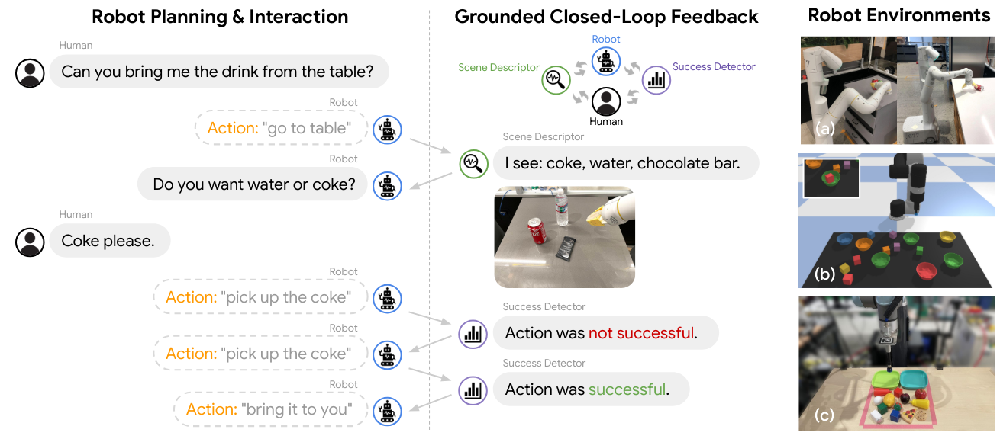

 Inner Monologue enables grounded closed-loop feedback for robot planning with large language models by leveraging a collection of perception models (e.g., scene descriptors and success detectors) in tandem with pretrained language-conditioned robot skills. Experiments show the system can reason and replan to accomplish complex long-horizon tasks for (a) mobile manipulation and (b,c) tabletop manipulation in both simulated and real settings.

***

##### Do As I Can, Not As I Say: Grounding Language in Robotic Affordances

- Paper Link: [arXiv 2204.01691](https://arxiv.org/abs/2204.01691) , [Homepage](https://say-can.github.io/)

- Framework Overview: 

    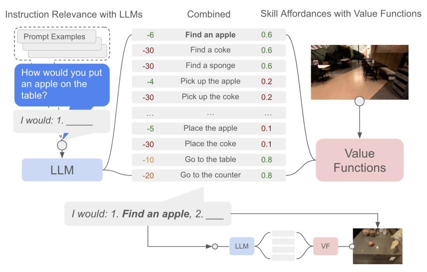

    ​	Given a high-level instruction, SayCan combines probabilities from a LLM (the probability that a skill is useful for the instruction) with the probabilities from a value function (the probability of successfully executing said skill) to select the skill to perform. This emits a skill that is both possible and useful. The process is repeated by appending the skill to the response and querying the models again, until the output step is to terminate. 

    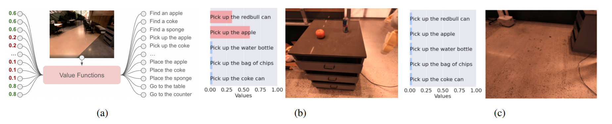

    ​	A value function module (a) is queried to form a value function space of action primitives based on the current observation. Visualizing “pick” value functions, in (b) “Pick up the red bull can” and “Pick up the apple” have high values because both objects are in the scene, while in (c) the robot is navigating an empty space, and thus none of the pick up actions receive high values.

***

##### Keep CALM and Explore: Language Models for Action Generation in Text-based Games

- Paper Link: [arXiv 2010.02903](https://arxiv.org/abs/2010.02903), [Homepage](https://github.com/princeton-nlp/calm-textgame)
- Overview:

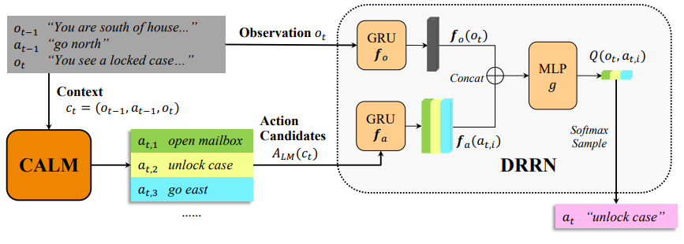

CALM combined with an RL agent – DRRN – for gameplay. CALM is trained on transcripts of human gameplay for action generation. At each state, CALM generates action candidates conditioned on the game context, and the DRRN calculates the Q-values over them to select an action. Once trained, a single instance of CALM can be used to generate actions for any text-based game.

***

## Foundational Approaches in Reinforcement Learning

>Understanding the foundational approaches in Reinforcement Learning, such as Curriculum Learning, RLHF and HITL, is crucial for our research. These methods represent the building blocks upon which modern RL techniques are built. By studying these early methods, we can gain a deeper understanding of the principles and mechanisms that underlie RL. This knowledge can then inform and inspire current work on the intersection of Language Model Learning (LLM) and RL, helping us to develop more effective and innovative solutions.

***

##### Using Natural Language for Reward Shaping in Reinforcement Learning

- Paper Link: [arXiv 1903.02020](https://arxiv.org/abs/1903.02020) 

- Framework Overview: 

    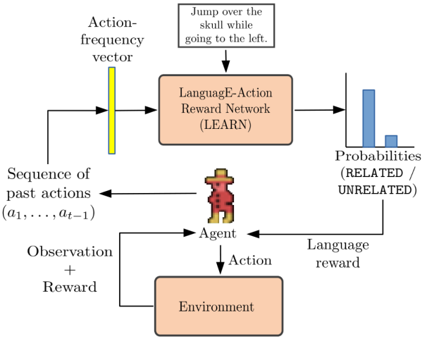

    The framework consists of the standard RL module containing the agent-environment loop, augmented with a LanguagE Action Reward Network (LEARN) module.

- Review:

    ​    This article provides a method of using natural language to provide rewards. At that time, there was no LLM, so this article used a large number of existing game videos and corresponding language descriptions as the dataset. An FNN was trained, which can output the relationship between the current trajectory and language command, and use this output as an intermediate reward. By combining it with the original sparse environment reward, the RL Agent can learn the optimal strategy faster based on both the goal and the language command.

***

##### DQN-TAMER: Human-in-the-Loop Reinforcement Learning with Intractable Feedback

- Paper Link: [arXiv 1810.11748](https://arxiv.org/abs/1810.11748)
- Overview: 

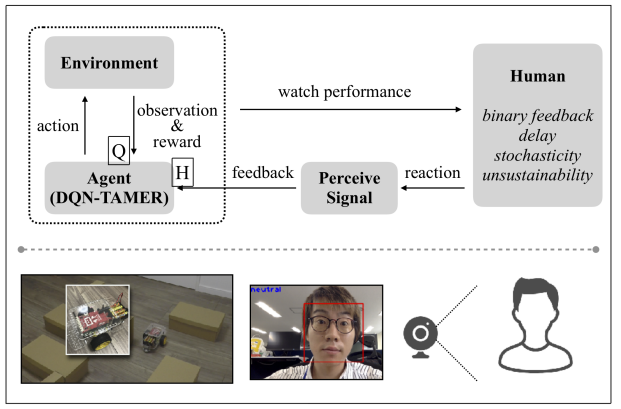

Overview of human-in-the-loop RL and the model (DQNTAMER). The agent asynchronously interacts with a human observer in the given environment. DQN-TAMER decides actions based on two models. One (Q) estimates rewards from the environment and the other (H) for feedback from the human. 

***

##### Overcoming Exploration in Reinforcement Learning with Demonstrations

- Paper Link: [arXiv 1709.10089](https://arxiv.org/abs/1709.10089), [Homepage](https://ashvin.me/demoddpg-website/)
- Overview:

Exploration in environments with sparse rewards has been a persistent problem in reinforcement learning (RL). Many tasks are natural to specify with a sparse reward, and manually shaping a reward function can result in suboptimal performance. However, finding a non-zero reward is exponentially more difficult with increasing task horizon or action dimensionality. This puts many real-world tasks out of practical reach of RL methods. In this work, we use demonstrations to overcome the exploration problem and successfully learn to perform long-horizon, multi-step robotics tasks with continuous control such as stacking blocks with a robot arm. Our method, which builds on top of Deep Deterministic Policy Gradients and Hindsight Experience Replay, provides an order of magnitude of speedup over RL on simulated robotics tasks. It is simple to implement and makes only the additional assumption that we can collect a small set of demonstrations. Furthermore, our method is able to solve tasks not solvable by either RL or behavior cloning alone, and often ends up outperforming the demonstrator policy.

***

##### Automatic Goal Generation for Reinforcement Learning Agents

- Paper Link: [arXiv 1705.06366](https://arxiv.org/abs/1705.06366), [Homepage](https://sites.google.com/view/goalgeneration4rl)
- Overview: 

Reinforcement learning (RL) is a powerful technique to train an agent to perform a task; however, an agent that is trained using RL is only capable of achieving the single task that is specified via its reward function.   Such an approach does not scale well to settings in which an agent needs to perform a diverse set of tasks, such as navigating to varying positions in a room or moving objects to varying locations.  Instead, the authors propose a method that allows an agent to automatically discover the range of tasks that it is capable of performing in its environment.  the authors use a generator network to propose tasks for the agent to try to accomplish, each task being specified as reaching a certain parametrized subset of the state-space.  The generator network is optimized using adversarial training to produce tasks that are always at the appropriate level of difficulty for the agent, thus automatically producing a curriculum.  the authors show that, by using this framework, an agent can efficiently and automatically learn to perform a wide set of tasks without requiring any prior knowledge of its environment, even when only sparse rewards are available.

***

## Open source RL environment 

- Awesome RL environments: https://github.com/clvrai/awesome-rl-envs

    This repository has a comprehensive list of categorized reinforcement learning environments.

- Mine Dojo: https://github.com/MineDojo/MineDojo

    ​	MineDojo features a **massive simulation suite** built on Minecraft with 1000s of diverse tasks, and provides **open access to an internet-scale knowledge base** of 730K YouTube videos, 7K Wiki pages, 340K Reddit posts.

    

 

- MineRL: https://github.com/minerllabs/minerl , https://minerl.readthedocs.io/en/latest/

    ​	MineRL is a rich Python 3 library which provides a [OpenAI Gym](https://gym.openai.com/) interface for interacting with the video game Minecraft, accompanied with datasets of human gameplay.

    

- ALFworld: https://github.com/alfworld/alfworld?tab=readme-ov-file , https://alfworld.github.io/

    ​	**ALFWorld** contains interactive TextWorld environments (Côté et. al) that parallel embodied worlds in the ALFRED dataset (Shridhar et. al). The aligned environments allow agents to reason and learn high-level policies in an abstract space before solving embodied tasks through low-level actuation.

    

- Skillhack: https://github.com/ucl-dark/skillhack

    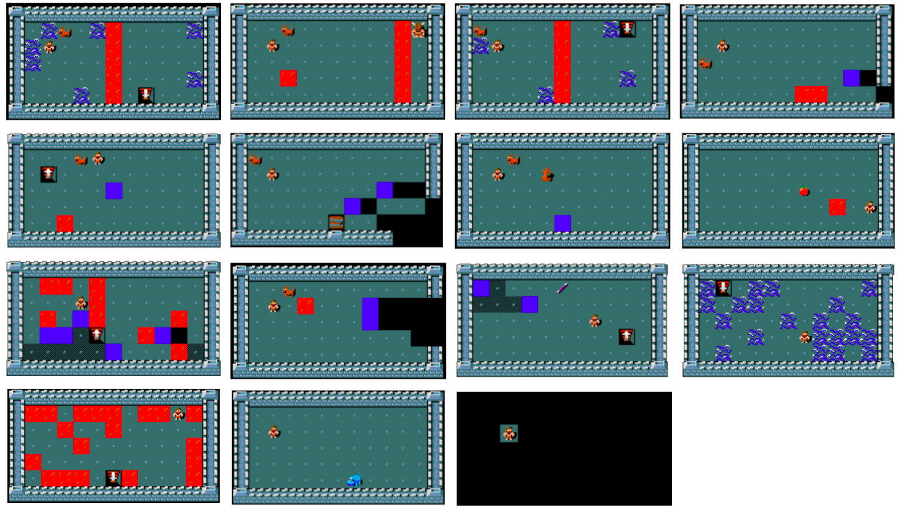

- Minigrid: https://github.com/Farama-Foundation/MiniGrid?tab=readme-ov-file

    

- Crafter: https://github.com/danijar/crafter?tab=readme-ov-file

    

- OpenAI procgen: https://github.com/openai/procgen

    

- Petting ZOO MPE: https://pettingzoo.farama.org/environments/mpe/

      

- OpenAI Multi Agent Particle Env: https://github.com/openai/multiagent-particle-envs

    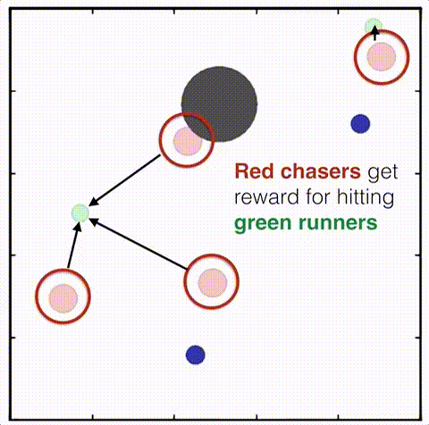

- Multi Agent RL Environment: https://github.com/Bigpig4396/Multi-Agent-Reinforcement-Learning-Environment

    

- MAgent2: https://github.com/Farama-Foundation/MAgent2?tab=readme-ov-file

    
