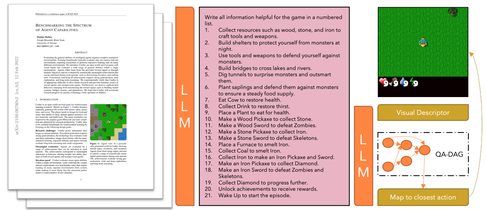

# LLM RL Papers

1. Monitoring recent cross-research on LLM &amp; RL on arXiv.
2. Focusing on combining LLM & RL capabilities for control (such as game characters).
3. Feel free to open PRs if you want to share the good papers you’ve read.

***

## Table of Content

* [Research Review](#research-review)
  + [The RL/LLM Taxonomy Tree: Reviewing Synergies Between Reinforcement Learning and Large Language Models](#the-rlllm-taxonomy-tree-reviewing-synergies-between-reinforcement-learning-and-large-language-models)
* [Papers [sort by time]](#papers-sort-by-time)
  + [Yell At Your Robot: Improving On-the-Fly from Language Corrections](#yell-at-your-robot-improving-on-the-fly-from-language-corrections)
  + [EnvGen: Generating and Adapting Environments via LLMs for Training Embodied Agents](#envgen-generating-and-adapting-environments-via-llms-for-training-embodied-agents)
  + [RLingua: Improving Reinforcement Learning Sample Efficiency in Robotic Manipulations With Large Language Models](#rlingua-improving-reinforcement-learning-sample-efficiency-in-robotic-manipulations-with-large-language-models)
  + [RL-GPT: Integrating Reinforcement Learning and Code-as-policy](#rl-gpt-integrating-reinforcement-learning-and-code-as-policy)
  + [How Can LLM Guide RL? A Value-Based Approach](#how-can-llm-guide-rl-a-value-based-approach)
  + [Policy Improvement using Language Feedback Models](#policy-improvement-using-language-feedback-models)
  + [Natural Language Reinforcement Learning](#natural-language-reinforcement-learning)
  + [Hierarchical Continual Reinforcement Learning via Large Language Model](#hierarchical-continual-reinforcement-learning-via-large-language-model)
  + [True Knowledge Comes from Practice: Aligning LLMs with Embodied Environments via Reinforcement Learning](#true-knowledge-comes-from-practice-aligning-llms-with-embodied-environments-via-reinforcement-learning)
  + [AutoRT: Embodied Foundation Models for Large Scale Orchestration of Robotic Agents](#AutoRT-Embodied-Foundation-Models-for-Large-Scale-Orchestration-of-Robotic-Agents)
  + [Large Language Model as a Policy Teacher for Training Reinforcement Learning Agents](#large-language-model-as-a-policy-teacher-for-training-reinforcement-learning-agents)
  + [Language and Sketching: An LLM-driven Interactive Multimodal Multitask Robot Navigation Framework](#language-and-sketching-an-llm-driven-interactive-multimodal-multitask-robot-navigation-framework)
  + [LLM Augmented Hierarchical Agents](#llm-augmented-hierarchical-agents)
  + [Eureka: Human-Level Reward Design via Coding Large Language Models](#eureka-human-level-reward-design-via-coding-large-language-models)
  + [Text2Reward: Automated Dense Reward Function Generation for Reinforcement Learning](#text2reward-automated-dense-reward-function-generation-for-reinforcement-learning)
  + [SPRING: Studying the Paper and Reasoning to Play Games](#spring-studying-the-paper-and-reasoning-to-play-games)
  + [Reward Design with Language Models](#reward-design-with-language-models)
  + [Skill Reinforcement Learning and Planning for Open-World Long-Horizon Tasks](#skill-reinforcement-learning-and-planning-for-open-world-long-horizon-tasks)
  + [Guiding Pretraining in Reinforcement Learning with Large Language Models](#guiding-pretraining-in-reinforcement-learning-with-large-language-models)
  + [Do As I Can, Not As I Say: Grounding Language in Robotic Affordances](#do-as-i-can-not-as-i-say-grounding-language-in-robotic-affordances)
* [Open source RL environment](#open-source-rl-environment)

<small><i><a href='http://ecotrust-canada.github.io/markdown-toc/'>Table of contents generated with markdown-toc</a></i></small>

***

## Research Review

###  The RL/LLM Taxonomy Tree: Reviewing Synergies Between Reinforcement Learning and Large Language Models

- Paper Link: [arXiv 2402.01874](https://arxiv.org/abs/2402.01874) 

- Overview:

    

    ​	This study proposes a novel taxonomy of three main classes based on how RL and LLMs interact with each other:

    - RL4LLM: RL is used to improve the performance of LLMs on tasks related to Natural Language Processing.
    - LLM4RL: An LLM assists the training of an RL model that performs a task not inherently related to natural language.
    - RL+LLM: An LLM and an RL agent are embedded in a common planning framework without either of them contributing to training or fine-tuning of the other.

***

## Papers [sort by time]

### Yell At Your Robot: Improving On-the-Fly from Language Corrections

- Paper Link: [arXiv 2403.12910](https://arxiv.org/abs/2403.12910) , [Homepage](https://yay-robot.github.io/)

- Framework Overview: 

    

    ​	The authors operate in a hierarchical setup where a high-level policy generates language instructions for a low-level policy that executes the corresponding skills. During deployment, humans can intervene through corrective language commands, temporarily overriding the high-level policy and directly influencing the low-level policy for on-the-fly adaptation. These interventions are then used to finetune the high-level policy, improving its future performance.

    

    ​	The system processes RGB images and the robot's current joint positions as inputs, outputting target joint positions for motor actions. The high-level policy uses a Vision Transformer to encode visual inputs and predicts language embeddings. The low-level policy uses ACT, a Transformer-based model to generate precise motor actions for the robot, guided by language instructions. This architecture enables the robot to interpret commands like “Pick up the bag” and translate them into targeted joint movements.

***

### EnvGen: Generating and Adapting Environments via LLMs for Training Embodied Agents

- Paper Link: [arXiv 2403.12014](https://arxiv.org/abs/2403.12014) , [Homepage](https://envgen-llm.github.io/)

- Framework Overview: 

    

    ​    In EnvGen framework, the authors generate multiple environments with an LLM to let the agent learn different skills effectively, with the N-cycle training cycles, each consisting of the following four steps. 

    ​    **Step 1:** provide an LLM with a prompt composed of four components (*i.e*., task description, environment details, output template, and feedback from the previous cycle), and ask the LLM to fill the template and output various environment configurations that can be used to train agents on different skills. 

    ​    **Step 2:** train a small RL agent in the LLM-generated environments. 

    ​    **Step 3:** train the agent in the original environment to allow for better generalization and then measure the RL agent’s training progress by letting it explore the original environment. 

    ​    **Step 4:** provide the LLM with the agent performance from the original environment (measured in step 3) as feedback for adapting the LLM environments in the next cycle to focus on the weaker performing skills.

- Review:
        The highlight of this paper is that it uses LLM to design initial training environment conditions, which helps the RL agent learn the strategy of long-horizon tasks more quickly. This is a concept of decomposing long-horizon tasks into smaller tasks and then retraining, accelerating the training efficiency of RL. It also uses a feedback mechanism that allows LLM to revise the conditions based on the training effect of RL. Only four interactions with LLM are needed to significantly improve the training efficiency of RL and reduce the usage cost of LLM.

***

### RLingua: Improving Reinforcement Learning Sample Efficiency in Robotic Manipulations With Large Language Models

- Paper Link: [arXiv 2403.06420](https://arxiv.org/abs/2403.06420) , [homepage](https://rlingua.github.io/)

- Framework Overview:

    

    ​	(a) Motivation: LLMs do not need environment samples and are easy to communicate for non-experts. However, the robot controllers generated directly by LLMs may have inferior performance. In contrast, RL can be used to train robot controllers to achieve high performance. However, the cost of RL is its high sample complexity. (b) Framework: RLingua extracts the internal knowledge of LLMs about robot motion to a coded imperfect controller, which is then used to collect data by interaction with the environment. The robot control policy is trained with both the collected LLM demonstration data and the interaction data collected by the online training policy.

    

    ​	The framework of prompt design with human feedback. The task descriptions and coding guidelines are prompted in sequence. The human feedback is provided after observing the preliminary LLM controller execution process on the robot.

- Review: 

    ​    The highlight of this article is the simultaneous application of LLM and RL to generate training data for online training policy. The control code generated by LLM is also considered a policy, achieving a mathematical form of unity. The main function of this policy is to run on robot and sample data. The focus of this article is on the design of LLM, that is, two types of prompt processes, namely with human feedback and with code template, as well as how to design prompts. The design of the prompts is very detailed and worth learning from.

***

### RL-GPT: Integrating Reinforcement Learning and Code-as-policy

- Paper Link : [arXiv 2402.19299](https://arxiv.org/abs/2402.19299) ,  [homepage](https://sites.google.com/view/rl-gpt/)

- Framework Overview: 

    

    ​	The overall framework consists of a slow agent (orange) and a fast agent (green). The slow agent decomposes the task and determines “which actions” to learn. The fast agent writes code and RL configurations for low-level execution.

- Review: 

    ​    This framework integrates “Code as Policies”, “RL training”, and “LLM planning”. It first allows the LLM to decompose tasks into actions, which are then further decomposed based on their complexity. Simple actions can be directly coded, while complex actions use a combination of code and RL. The framework also applies a Critic to continuously improve the code and planning. The highlight of this paper is the integration of LLM’s code into RL’s action space for training, and this interactive approach is worth learning from.

***

### How Can LLM Guide RL? A Value-Based Approach

- Paper Link: [arXiv 2402.16181](https://arxiv.org/abs/2402.16181) , [Homepage](https://github.com/agentification/Language-Integrated-VI)

- Framework Overview: 

    

    ​	Demonstration of the SLINVIT algorithm in the ALFWorld environment when N=2 and the tree breadth of BFS is set to k=3. The task is to “clean a cloth and put it on countertop”. The hallucination that LLM faces, i.e., the towel should be taken (instead of cloth), is addressed by the inherent exploration mechanism in our RL framework.

- Review

    ​    The main idea of this article is to assign the task to an LLM, explore extensively within a BFS (Breadth-First Search) framework, generate multiple policies, and propose two ways to estimate value. One approach is based on code, suitable for scenarios where achieving the goal involves fulfilling multiple preconditions. The other approach relies on Monte Carlo methods. Then select the best policy with the highest value, and combine it with RL policy to enhance data sampling and policy improvement.

***

### Policy Improvement using Language Feedback Models

- Paper Link : [arXiv 2402.07876](https://arxiv.org/abs/2402.07876) 

- Framework Overview: 

    

***

### Natural Language Reinforcement Learning

- Paper Link: [arXiv 2402.07157](https://arxiv.org/abs/2402.07157) 

- Framework Overview: 

    

    ​	The authors present an illustrative example of grid-world MDP to show how NLRL and traditional RL differ for task objective, value function, Bellman equation, and generalized policy iteration. In this grid-world, the robot needs to reach the crown and avoid all dangers. They assume the robot policy takes optimal action at each non-terminal state, except a uniformly random policy at state b.

- Review: 

    ​    This paper employs RL as a pipeline for LLM, which is an intriguing research approach. The optimal policy within the framework aligns with the task description. The quality of each state and state-action value depends on how well they align with the task description. The state-action description comprises both the reward and the description of the next state. And the state description is a summary of the all possible state-action description. 

    ​    During the policy estimation step, the state description mimics either the Monte Carlo (MC) or Temporal Difference (TD) methods commonly used in RL. MC focuses on multi-step moves, evaluating based on the final state, while TD emphasizes single-step moves, returning the description of the next state. Finally, the LLM synthesizes all results to derive the current state description. In the policy improvement step, the LLM selects the best state-action pair to make decisions regarding actions.

***

### Hierarchical Continual Reinforcement Learning via Large Language Model

- Paper Link: [arXiv 2401.15098](https://arxiv.org/abs/2401.15098)

- Framework Overview:

  

  ​	The illustration of the proposed framework. The middle section depicts the internal interactions (**light gray line**) and external interactions (**dark gray line**) in Hi-Core. Internally, the CRL agent is structured in two layers: the high-level policy formulation (**orange**) and the low-level policy learning (**green**). Furthermore, the policy library (**blue**) is constructed to store and retrieve policies. The three surrounding boxes illustrate their internal workflow when the agent encounters new tasks.

- Method Overview: 

    ​	The high level LLM is used to generate a series of goals g_i . The low level is a RL with goal-directed, it needs to generate a policy in response to the goals. Policy library is used to store successful policy. When encountering new tasks, the library can retrieve relevant experience to assist high and low level policy agent.

***

### True Knowledge Comes from Practice: Aligning LLMs with Embodied Environments via Reinforcement Learning

- Paper Link: [arXiv 2401.14151](https://arxiv.org/abs/2401.14151) , [homepage](https://github.com/WeihaoTan/TWOSOME)

- Framework Overview: 

    

    ​	Overview of how TWOSOME generates a policy using joint probabilities of actions. The color areas in the token blocks indicate the probabilities of the corresponding token in the actions.

- Method Overview: 

    ​	The authors propose *True knoWledge cOmeS frOM practicE*(**TWOSOME**) online framework. It deploys LLMs as embodied agents to efficiently interact and align with environments via RL to solve decision-making tasks w.o. prepared dataset or prior knowledge of the environments. They use the loglikelihood scores of each token provided by LLMs to calculate the joint probabilities of each action and form valid behavior policies.

***

### AutoRT: Embodied Foundation Models for Large Scale Orchestration of Robotic Agents

- Paper Link: [arXiv 2401.12963](https://arxiv.org/abs/2401.12963) , [Homepage](https://auto-rt.github.io/)

- Framework Overview:

    

    ​	AutoRT is an exploration into scaling up robots to unstructured "in the wild" settings. The authors use VLMs to do open-vocab description of what the robot sees, then pass that description to an LLM which proposes natural language instructions. The proposals are then critiqued by another LLM using what they call a *robot constitution*, to refine instructions towards safer completable behavior. This lets them run robots in more diverse environments where they do not know the objects the robot will encounter ahead of time, collecting data on self-generated tasks.

- Review: 

    ​	The main contribution of this paper is the design of a framework that uses a Language Learning Model (LLM) to assign tasks to robots based on the current scene and skill. During the task execution phase, various robot learning methods, such as Reinforcement Learning (RL), can be employed. The data obtained during execution is then added to the database. 

    ​	Through this iterative process, and with the addition of multiple robots, the data collection process can be automated and accelerated. This high-quality data can be used for training more robots in the future. This work lays the foundation for training robot learning based on a large amount of real physics data.

***

### Large Language Model as a Policy Teacher for Training Reinforcement Learning Agents

- Paper Link: [arXiv 2311.13373](https://arxiv.org/abs/2311.13373)

- Framework Overview: 

    

    ​	An illustration of our LLM4Teach framework using the MiniGrid environment as an exemplar. The LLM-based teacher agent responds to observations of the state provided by the environment by offering soft instructions. These instructions take the form of a distribution over a set of suggested actions. The student agent is trained to optimize two objectives simultaneously. 	The first one is to maximize the expected return, the same as in traditional RL algorithms. The other one is to encourage the student agent to follow the guidance provided by the teacher. As the student agent’s expertise increases during the training process, the weight assigned to the second objective gradually decreases over time, reducing its reliance on the teacher.

***

### Language and Sketching: An LLM-driven Interactive Multimodal Multitask Robot Navigation Framework

- Paper Link: [arXiv 2311.08244](https://arxiv.org/abs/2311.08244) 

- Framework Overview: 

    

    ​	The framework contains an LLM module, an Intelligent Sensing Module, and a Reinforcement Learning Module.

***

### LLM Augmented Hierarchical Agents

- Paper Link: [arXiv 2311.05596](https://arxiv.org/abs/2311.05596) 

- Framework Overview: 

    

    ​	The LLM to guides the high-level policy and accelerates learning. It is prompted with the context, some examples, and the current task and observation. The LLM’s output biases high-level action selection.

***

### Eureka: Human-Level Reward Design via Coding Large Language Models

- Paper Link: [arXiv 2310.12931](https://arxiv.org/abs/2310.12931) , [Homepage](https://eureka-research.github.io/)

- Framework Overview: 

    

    ​	EUREKA takes unmodified environment source code and language task description as context to zero-shot generate executable reward functions from a coding LLM. Then, it iterates between reward sampling, GPU-accelerated reward evaluation, and reward reflection to progressively improve its reward outputs.

- Review

    The LLM in this article is used to design the reward function for RL. The main focus is on how to create a well-designed reward function. There are two approaches:

    1. **Evolutionary Search**: Initially, a large number of reward functions are generated, and their evaluation is done using hardcoded methods.
    2. **Reward Reflection**:  During training, intermediate reward variables are saved and fed back to LLM, allowing improvements to be made based on the original reward function.

    The first approach leans more toward static analysis, while the second approach emphasizes dynamic analysis. By combining these two methods, one can select and optimize the best reward function.

***

### Text2Reward: Automated Dense Reward Function Generation for Reinforcement Learning

- Paper Link: [arXiv 2309.11489](https://arxiv.org/abs/2309.11489)

- Framework Overview:

    

    ​	*Expert Abstraction* provides an abstraction of the environment as a hierarchy of Pythonic classes. *User Instruction* describes the goal to be achieved in natural language. *User Feedback* allows users to summarize the failure mode or their preferences, which are used to improve the reward code.

***

### SPRING: Studying the Paper and Reasoning to Play Games

- Paper Link: [arXiv 2305.15486](https://arxiv.org/abs/2305.15486), [Homepage](https://github.com/Holmeswww/SPRING)

- Framework Overview: 

    

    ​	Overview of SPRING. The context string, shown in the middle column, is obtained by parsing the LATEX source code of Hafner (2021). The LLM-based agent then takes input from a visual game descriptor and the context string. The agent uses questions composed into a DAG for chain-of-thought reasoning, and the last node of the DAG is parsed into action. 

***

### Reward Design with Language Models

- Paper Link: [arXiv 2303.00001](https://arxiv.org/abs/2303.00001)

- Framework Overview: 

    

    ​	Depiction of the framework on the DEAL OR NO DEAL negotiation task. A user provides an example and explanation of desired negotiating behavior (e.g., versatility) before training. During training, (1) they provide the LLM with a task description, a user’s description of their objective, an outcome of an episode that is converted to a string, and a question asking if the outcome episode satisfies the user objective. (2-3) They then parse the LLM’s response back into a string and use that as the reward signal for the Alice the RL agent. (4) Alice updates their weights and rolls out a new episode. (5) They parse the episode outcome int a string and continue training. During evaluation, they sample a trajectory from Alice and evaluate whether it is aligned with the user’s objective.

***

### Skill Reinforcement Learning and Planning for Open-World Long-Horizon Tasks

- Paper Link: [arXiv 2303.16563](https://arxiv.org/abs/2303.16563) , [Homepage](https://sites.google.com/view/plan4mc)

- Framework Overview: 

    

    ​	The authors categorize the basic skills in Minecraft into three types: Findingskills, Manipulation-skills, and Crafting-skills. We train policies to acquire skills with reinforcement learning. With the help of LLM, the authors extract relationships between skills and construct a skill graph in advance, as shown in the dashed box. During online planning, the skill search algorithm walks on the pre-generated graph, decomposes the task into an executable skill sequence, and interactively selects policies to solve complex tasks.

- Review

    ​	The highlight of the article lies in its use of LLM to generate skill graph,  thereby clarifying the sequential relationship between skills. When a task is input, the framework searches the skill graph using DFS to determine the skill to be selected at each step. RL is responsible for executing the skill and updating the state, iterating this process to break down complex tasks into manageable segments. 

    ​	Areas for improvement in the framework include:

     1. Currently, humans need to provide the available skills first. In the future, the framework should have ability to lean new skills autonomously.
     2. The application of LLM in the framework is mainly to build relationships between skills. Maybe this could potentially be achieved through hard coding, such as querying a Minecraft library to generate a skill graph.
***

### Guiding Pretraining in Reinforcement Learning with Large Language Models

- Paper Link: [arXiv 2302.06692](https://arxiv.org/abs/2302.06692) , [Homepage](https://github.com/yuqingd/ellm)

- Framework Overview: 

    

    ​	ELLM uses a pretrained large language model (LLM) to suggest plausibly useful goals in a task-agnostic way. Building on LLM capabilities such as context-sensitivity and common-sense, ELLM trains RL agents to pursue goals that are likely meaningful without requiring direct human intervention.

    ​	

    ​    ELLM uses GPT-3 to suggest adequate exploratory goals and SentenceBERT embeddings to compute the similarity between suggested goals and demonstrated behaviors as a form of intrinsically-motivated reward.

- Review: 

    ​    This paper is one of the earliest to use LLM for RL planning goals. The ELLM framework provides the current environmental information and available actions to the LLM, allowing it to design multiple reasonable goals based on common sense. RL then executes one of these goals. The reward function is determined based on the similarity of the embeddings of the goals and states. Since the embeddings are also generated by a  SentenceBERT model, it can also be said that the reward is generated by the LLM.

***

### Collaborating with language models for embodied reasoning

- Paper Link: [arXiv 2302.00763](https://arxiv.org/abs/2302.00763) 

- Framework Overview: 

    

    ​    A. Schematic of the Planner-Actor-Reporter paradigm and an example of the interaction among them. B. Observation and action space of the PycoLab environment.

- Review:

    The framework presented in this paper is simple yet clear, and it is one of the early works on using LLM for RL policy. In this framework, the Planner is an LLM, while the Reporter and Actor are RL components. The task requires the role to first inspect the properties of an item, and then select an item with the “good” property. The framework starts with the Planner, informing it of the task description and historical execution records. The Planner then chooses an action for the Actor. After the Actor executes the action, a result is obtained. The Reporter observes the environment and provides feedback to the Planner, and this process repeats.

***

### Do As I Can, Not As I Say: Grounding Language in Robotic Affordances

- Paper Link: [arXiv 2204.01691](https://arxiv.org/abs/2204.01691) , [Homepage](https://say-can.github.io/)

- Framework Overview: 

    

    ​	Given a high-level instruction, SayCan combines probabilities from a LLM (the probability that a skill is useful for the instruction) with the probabilities from a value function (the probability of successfully executing said skill) to select the skill to perform. This emits a skill that is both possible and useful. The process is repeated by appending the skill to the response and querying the models again, until the output step is to terminate. 

    

    ​	A value function module (a) is queried to form a value function space of action primitives based on the current observation. Visualizing “pick” value functions, in (b) “Pick up the red bull can” and “Pick up the apple” have high values because both objects are in the scene, while in (c) the robot is navigating an empty space, and thus none of the pick up actions receive high values.

***

## Open source RL environment 

- Awesome RL environments: https://github.com/clvrai/awesome-rl-envs

    This repository has a comprehensive list of categorized reinforcement learning environments.

- Mine Dojo: https://github.com/MineDojo/MineDojo

    ​	MineDojo features a **massive simulation suite** built on Minecraft with 1000s of diverse tasks, and provides **open access to an internet-scale knowledge base** of 730K YouTube videos, 7K Wiki pages, 340K Reddit posts.

    

 

- MineRL: https://github.com/minerllabs/minerl , https://minerl.readthedocs.io/en/latest/

    ​	MineRL is a rich Python 3 library which provides a [OpenAI Gym](https://gym.openai.com/) interface for interacting with the video game Minecraft, accompanied with datasets of human gameplay.

    

- ALFworld: https://github.com/alfworld/alfworld?tab=readme-ov-file , https://alfworld.github.io/

    ​	**ALFWorld** contains interactive TextWorld environments (Côté et. al) that parallel embodied worlds in the ALFRED dataset (Shridhar et. al). The aligned environments allow agents to reason and learn high-level policies in an abstract space before solving embodied tasks through low-level actuation.

    

- Skillhack: https://github.com/ucl-dark/skillhack

    

- Minigrid: https://github.com/Farama-Foundation/MiniGrid?tab=readme-ov-file

    

- Crafter: https://github.com/danijar/crafter?tab=readme-ov-file

    

- OpenAI procgen: https://github.com/openai/procgen

    

- OpenAI Multi Agent Particle Env: https://github.com/openai/multiagent-particle-envs

    

- Multi Agent RL Environment: https://github.com/Bigpig4396/Multi-Agent-Reinforcement-Learning-Environment

    

- MAgent2: https://github.com/Farama-Foundation/MAgent2?tab=readme-ov-file

    
